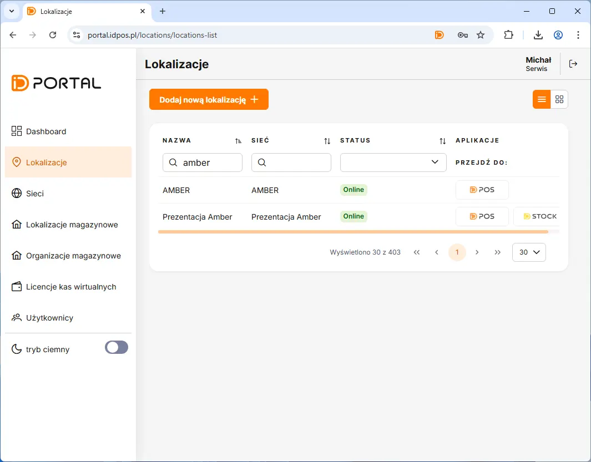
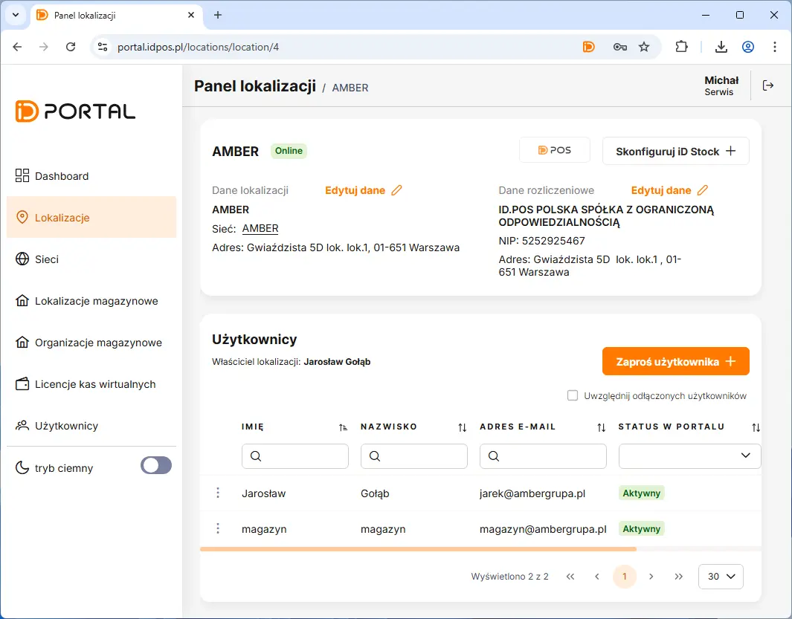
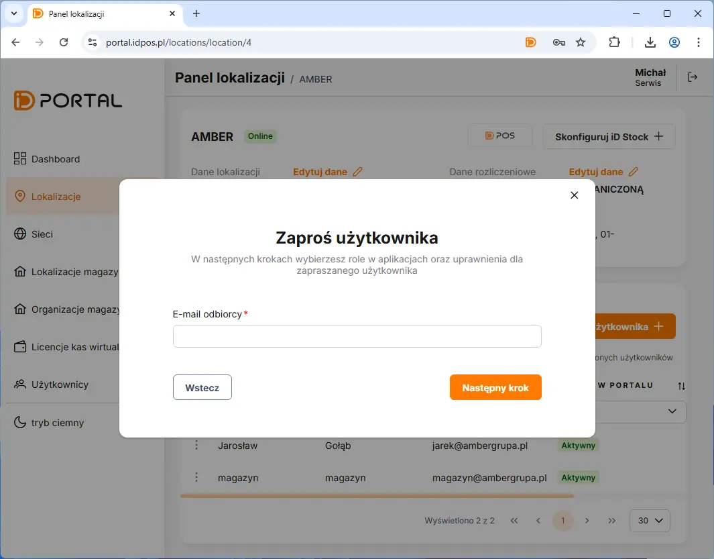
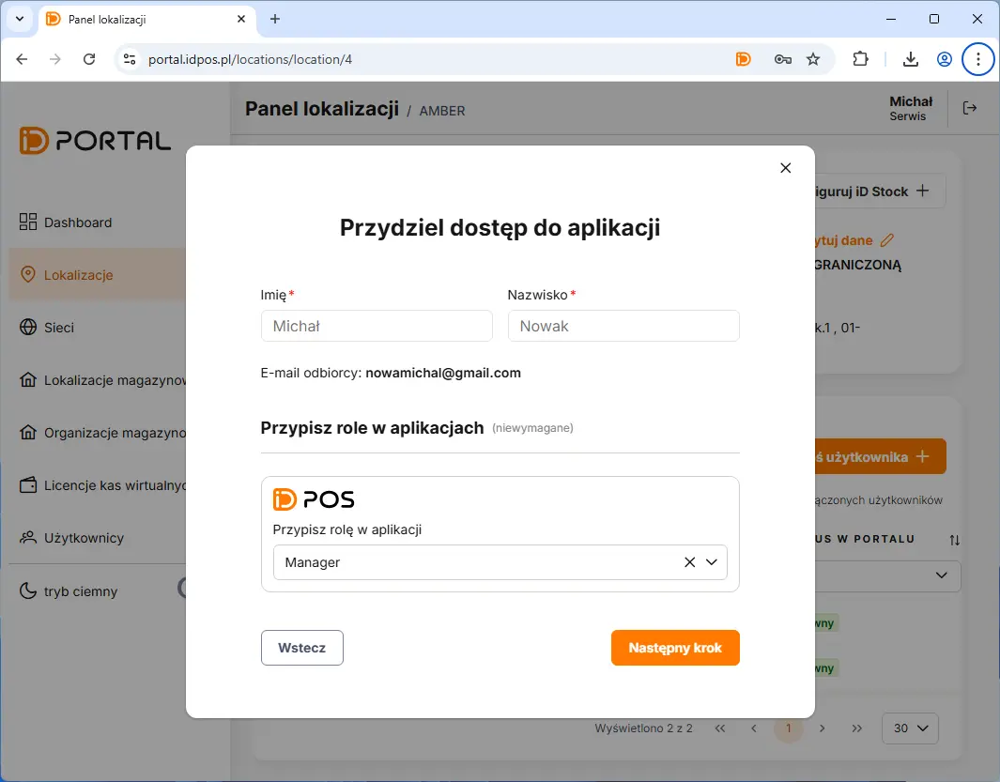
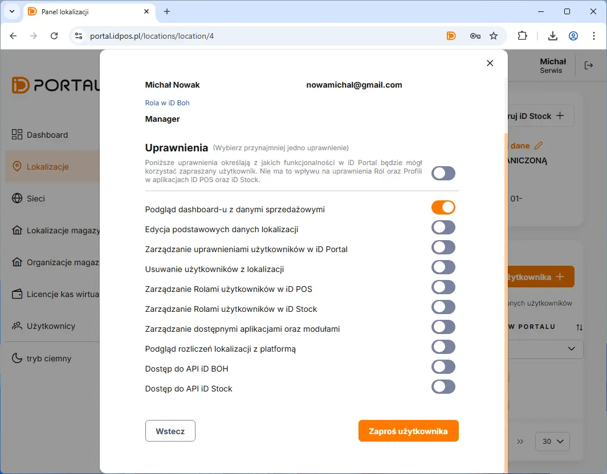

# Dodanie Dostępu dla Managera

Dodanie dostępu rozpoczynamy poprzez przejście w panelu na zakładkę **Lokalizacje** <kbd> -> </kbd> Następnie klikamy na liście lokalizacji w nazwę lokalu. 

<figure>

</figure>

Na otwartym panelu lokalizacji należy nacisnąć przycisk <button class="btn-id"> Zaproś użytkownika  +  </button> 

<figure>

</figure>

<figure>

</figure>

<figure>

</figure>

>  :warning:
   >
   > 
   > Użytkownik musi otrzymać uprawnienia do co najmniej jednej opcji z listy. 
   >

<figure>

</figure>

>  :warning:
   >
   > Jeżeli użytkownik którego zapraszamy nie posiada konta w portal.idpos.pl to musi dokonać rejestracji oraz aktywacji konta do 12 godzin od zaproszenia. Aktywacjia po upływie 12   godzin będzie wymagała wysłania ponownego zaproszenia.  
   >
