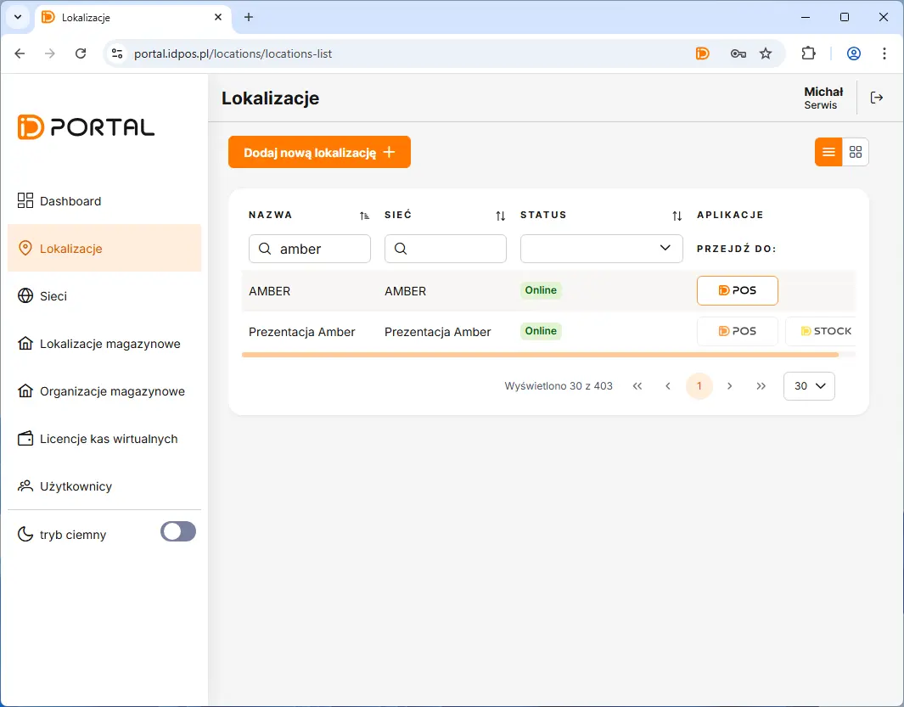
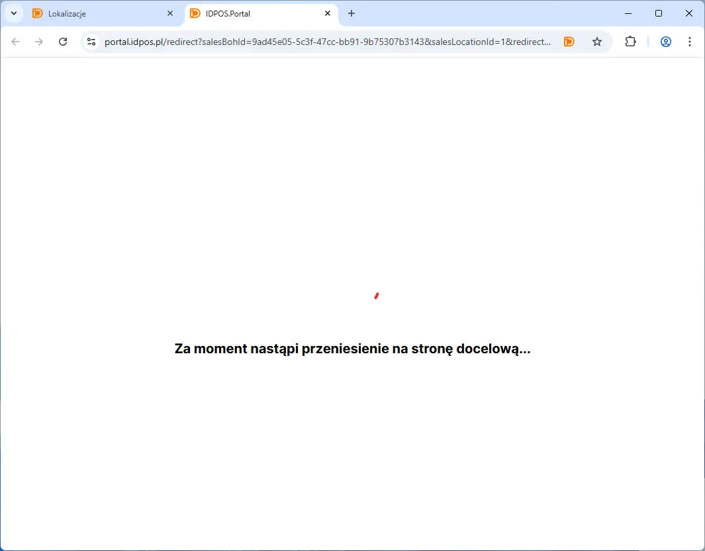
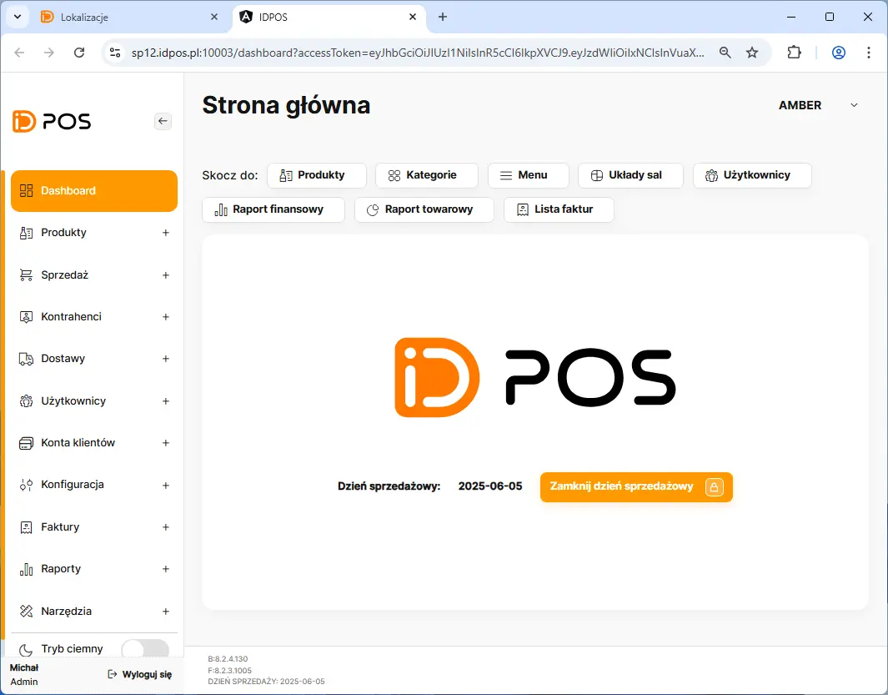

# Przejście z portalu do aplikacji BOH

Otwożenie BOHa rozpoczynamy poprzez przejście na zakładkę **Lokalizacje** <kbd> -> </kbd> Następnie klikamy w liście lokalizacji przycisk IDPOS 

<figure>

</figure>

<figure>

</figure>

<figure>

</figure>
