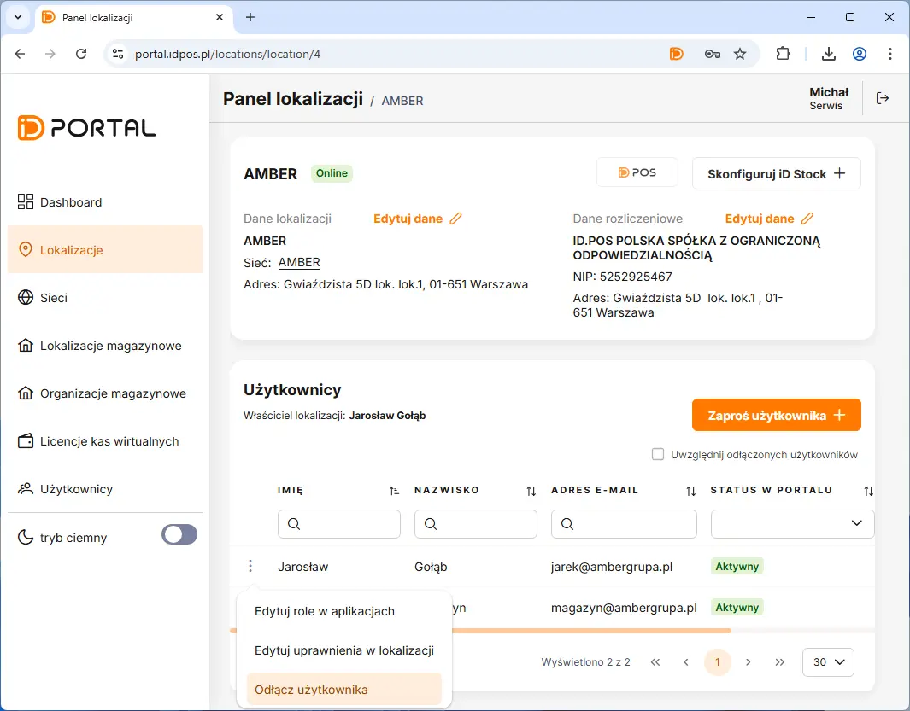

# Zablokowanie Dostępu dla Managera

Zablokowanie dostępu rozpoczynamy poprzez przejście w panelu na zakładkę **Lokalizacje** <kbd> -> </kbd> Następnie klikamy w liście lokalizacji na nazwę lokalu. 

Na otwartym panelu lokalizacji należy nacisnąć przycis " ... " obok użytkownika na liście. W otwartym menu kontekstowym należy wybrać opcjie "Odłącz użytkownika"

<figure>

</figure>
