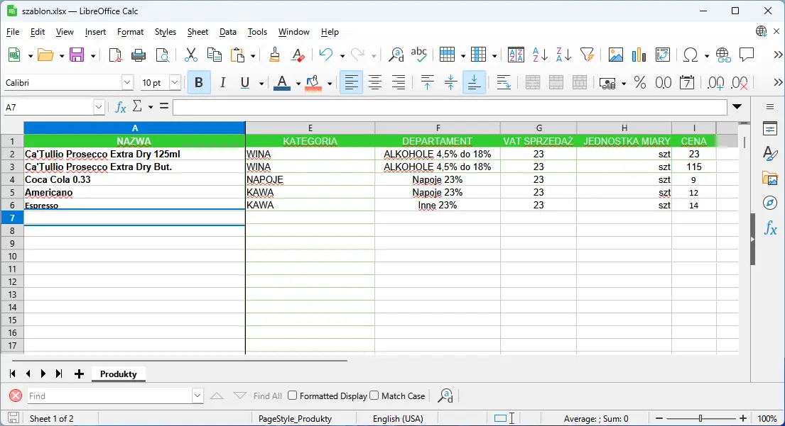
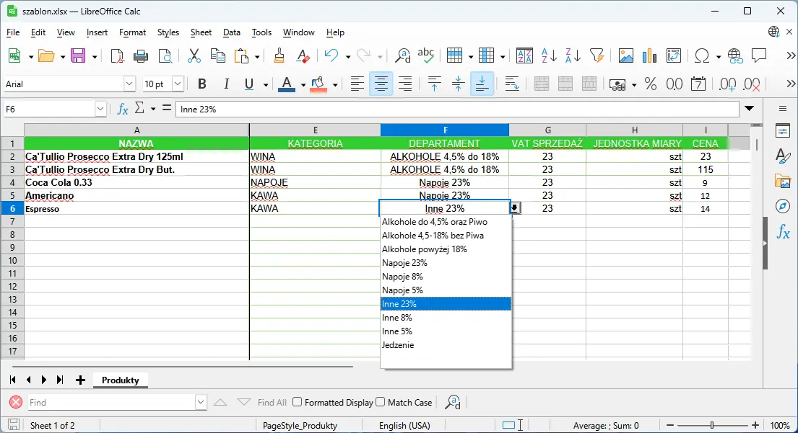
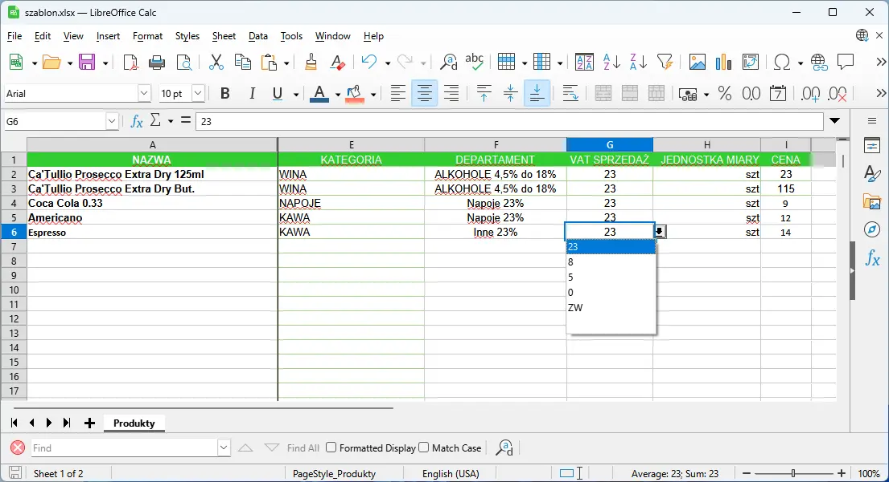
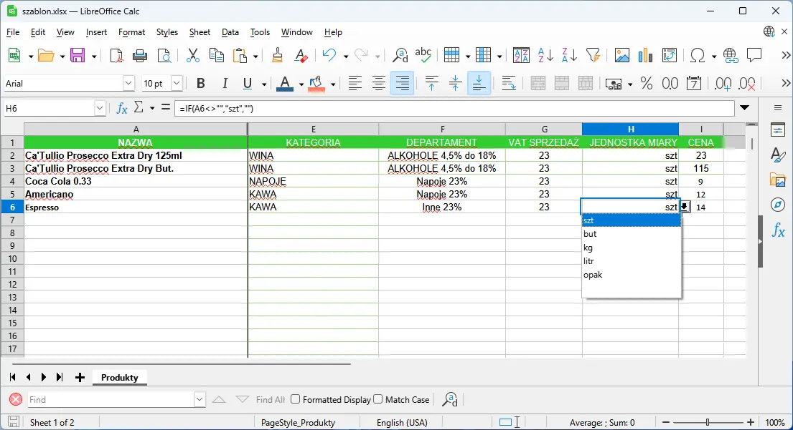

# Import Menu z exala

Dodanie menu przy pomocy arkusza rozpoczymany poprzez pobranie szablonu exel.  <a href="../public/szablon/szablon.xlsx" download>Pobierz plik Excel</a>

<figure>

</figure>

  > :warning:
   >
   > Podczas wyboru: departamentu, stawki vat oraz jednostki miary należy skożystać z listy rozwijanej.
   >
   > Nazwa nie możę zawierać znaków takich jak apostrof ('), myślnik (—), backtick (`) 

<figure>

</figure>

<figure>

</figure>

<figure>

</figure>

  >  :bulb:
   >
   > Przygotowany plik z menu należy przekazać e-mailem na adres **serwis@ambergrupa.pl** podając nazwę lokalu którego sprawa dotyczy. 
   >
   > 
   >