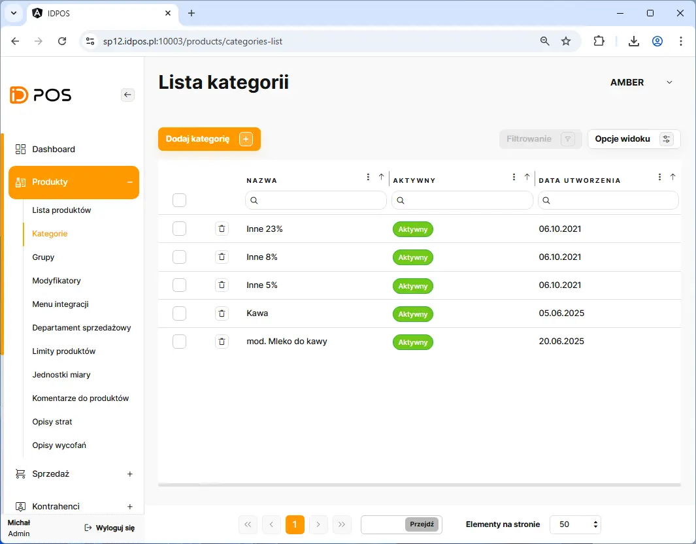
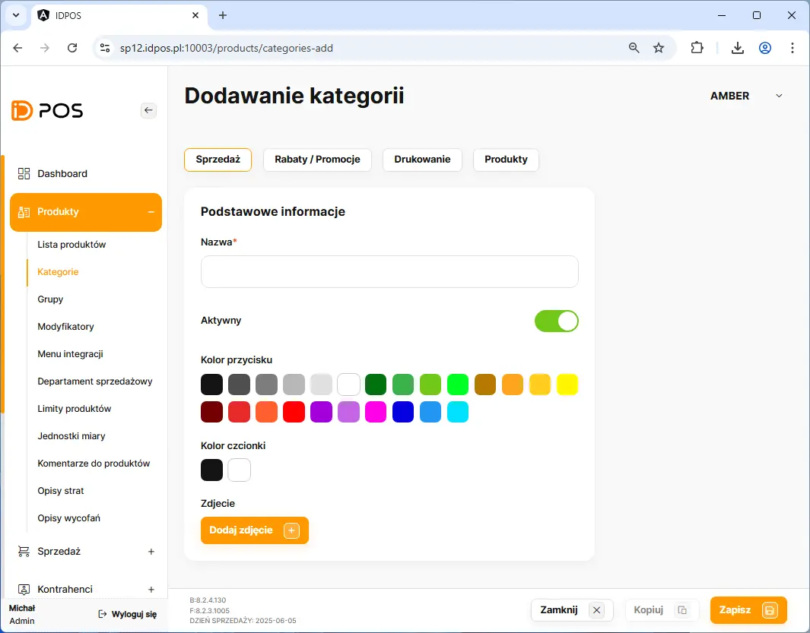
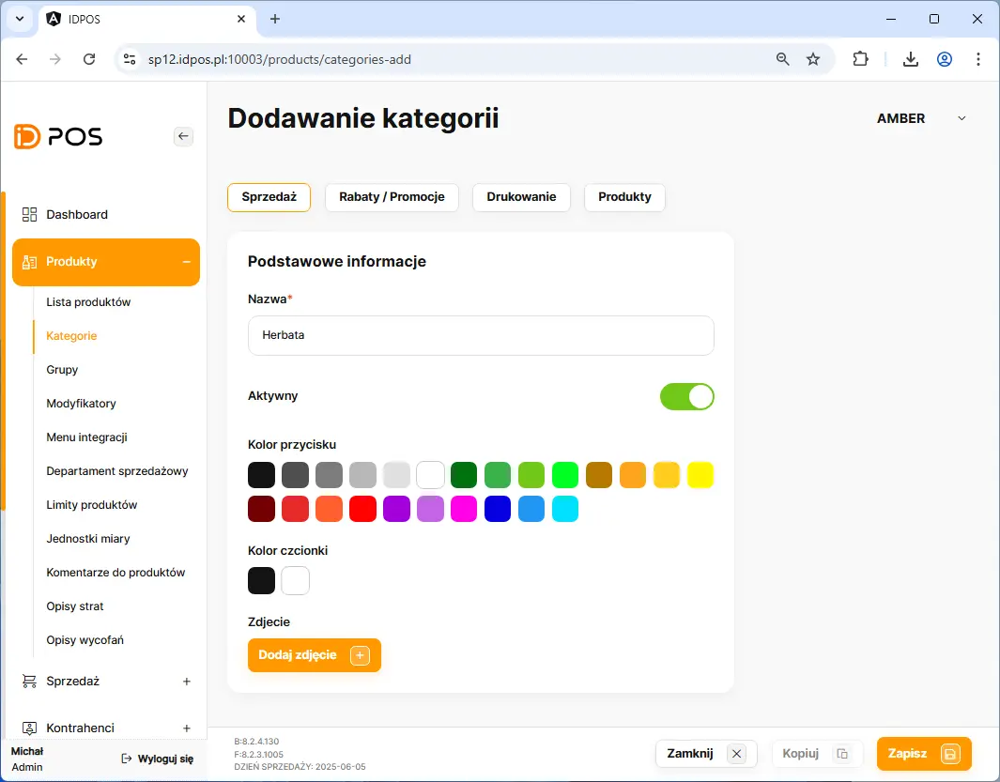
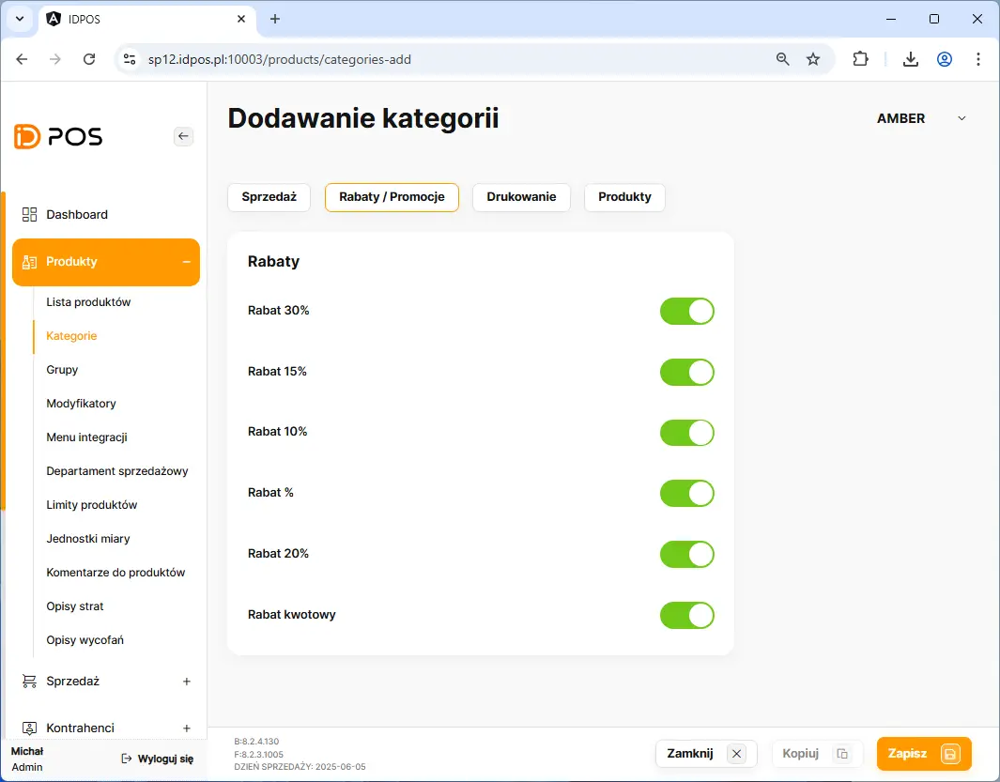
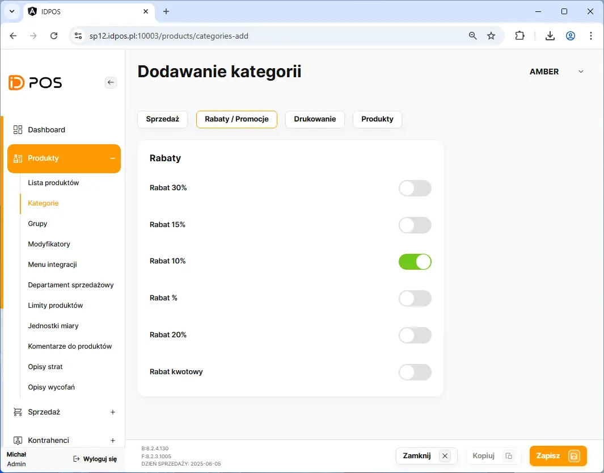
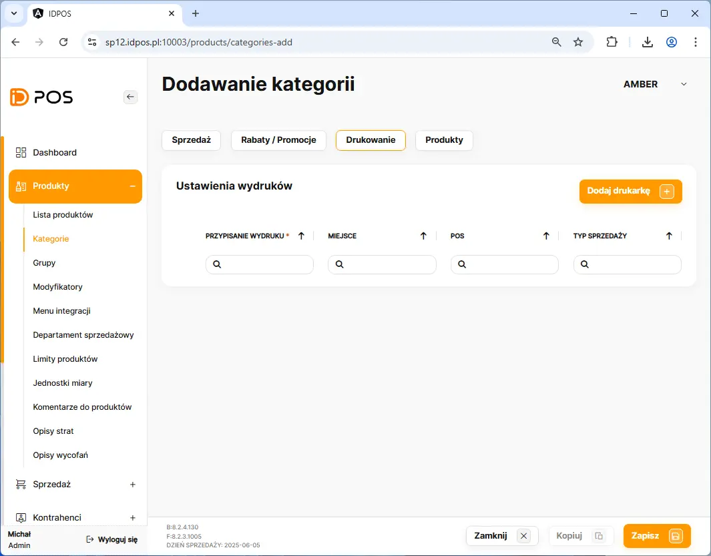
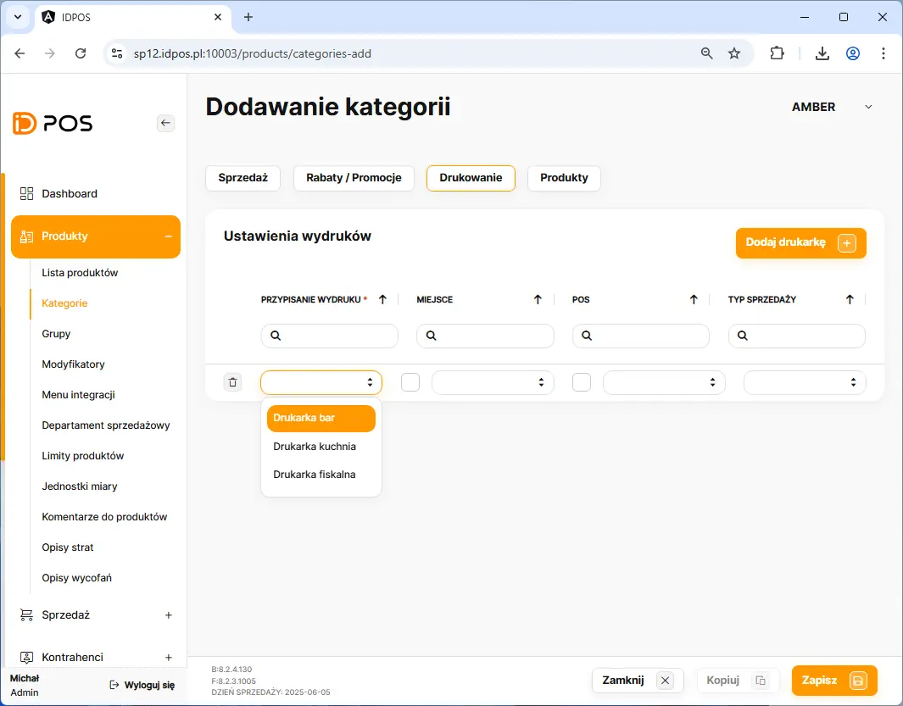
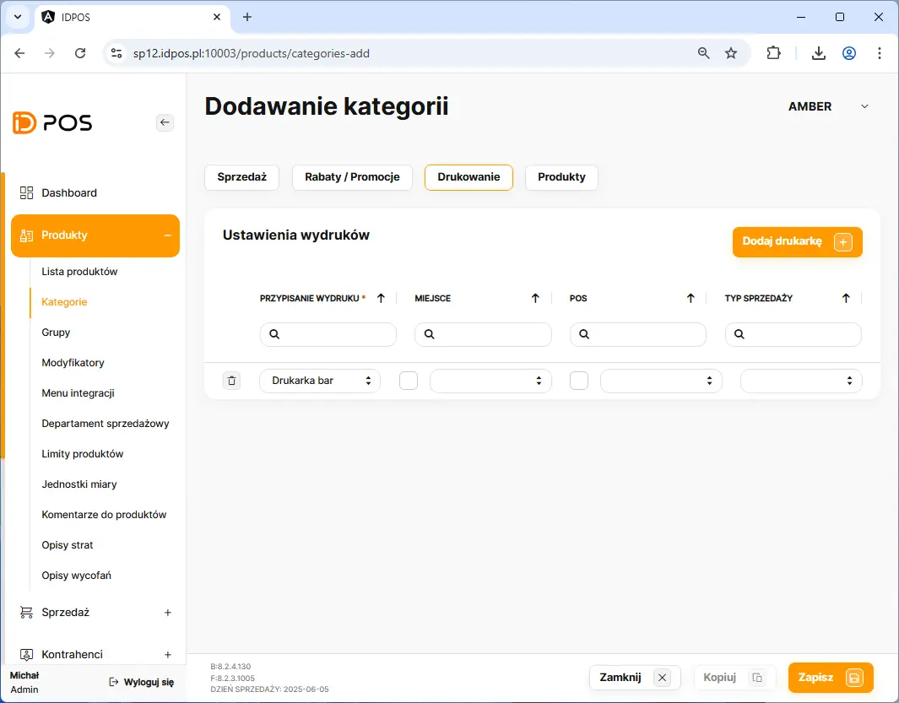
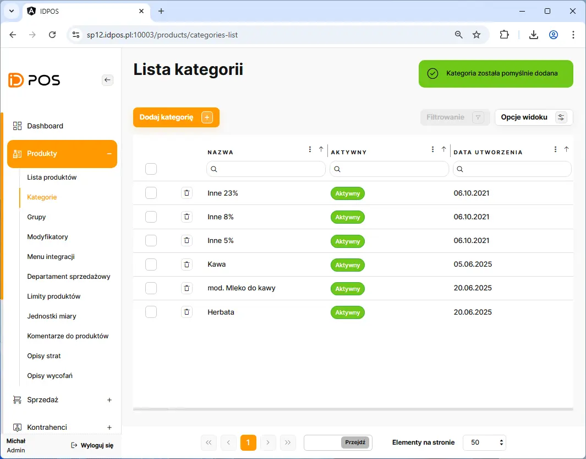

# Dodanie kategorii sprzedażowej

Dodanie Nowej kategorii rozpoczynamy poprzez przejście w BOHu na zakładkę: **Produkty** <kbd> -> </kbd> **Kategorie** 

Na liście kategorii należy kliknąć przycisk <button class="btn-id"> Dodaj kategorię  +  </button> 
    
<figure>

</figure>

##### Wymagane dane do wprawadzenia:
    - unikalna nazwa kategorii

<figure>

</figure>

<figure>

</figure>

##### Opcjonalnie do wprawadzenia:
    - ustawienie rabatów dla wszystkich produktów z kategorii. 
    

<figure>

</figure>

<figure>

</figure>

##### Wymagane dane do wprawadzenia:
    - przypisanie drukarki do kategorii lub grupy wydruku

<figure>

</figure>

<figure>

</figure>

<figure>

</figure>

<figure>

</figure>

<figure>

</figure>