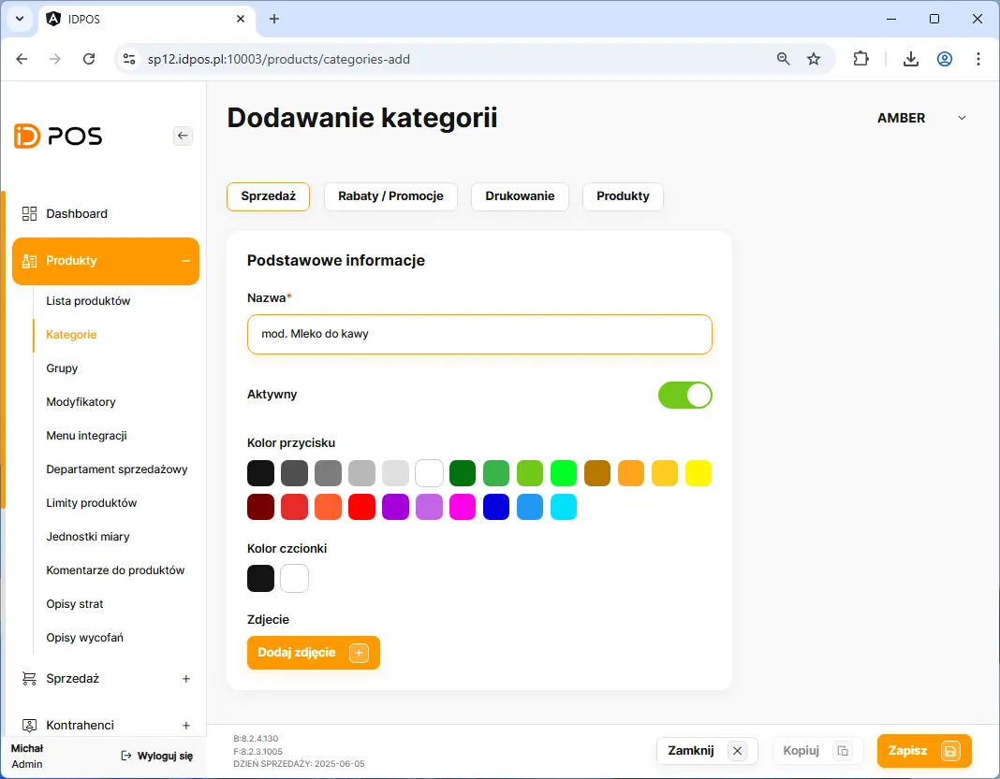
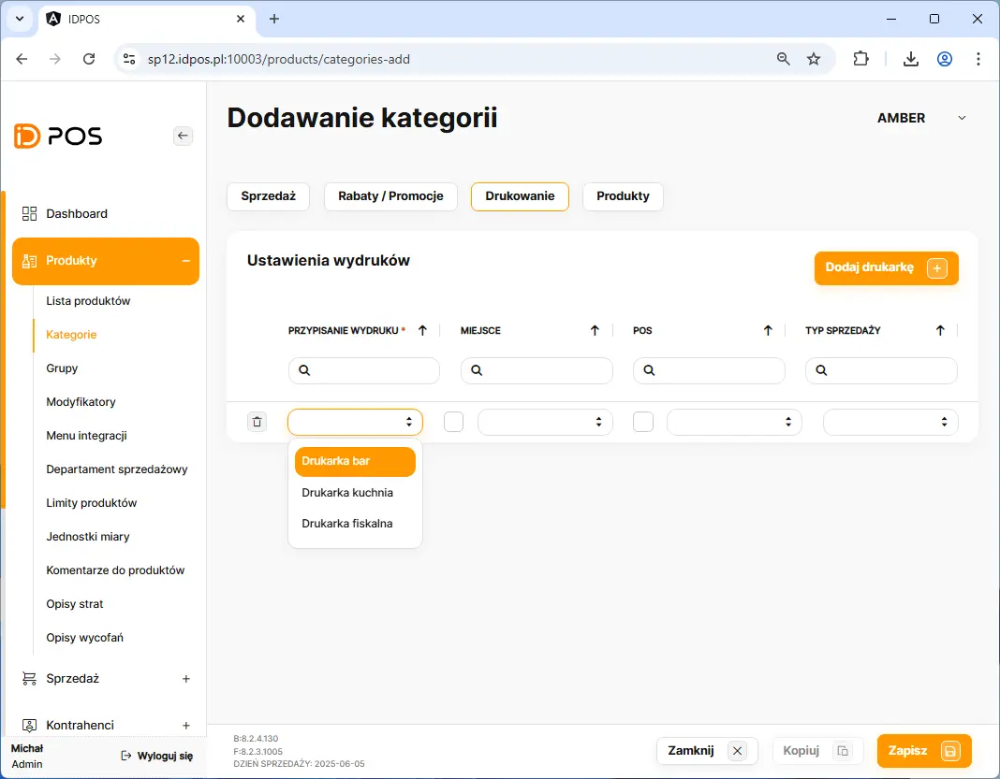
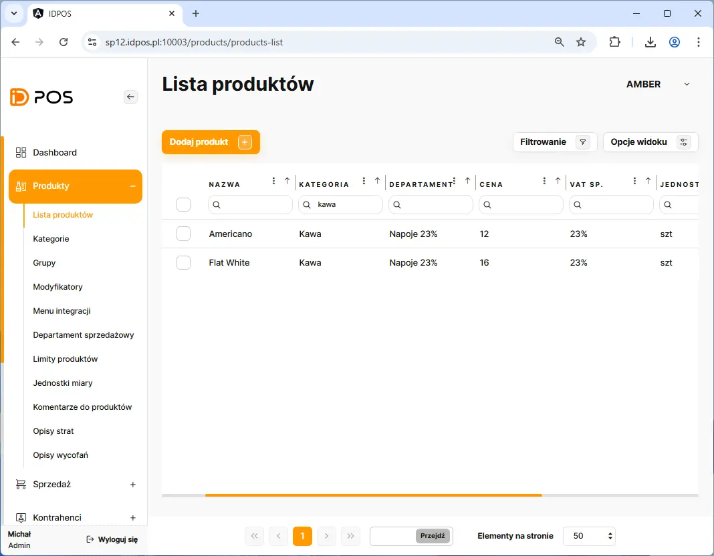
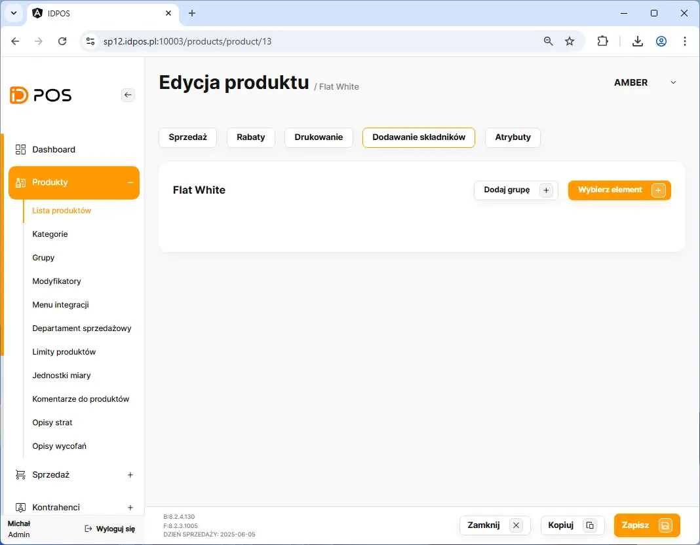
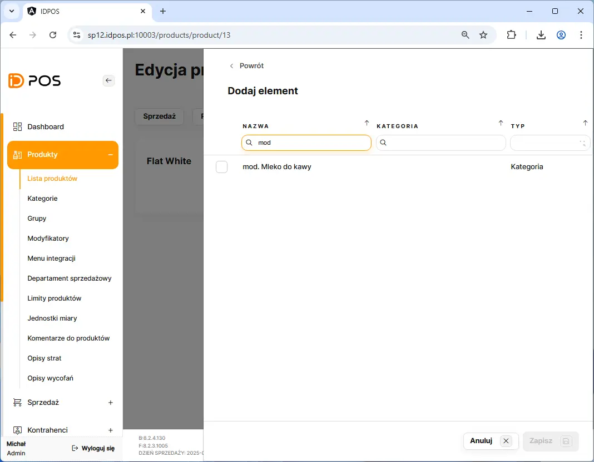
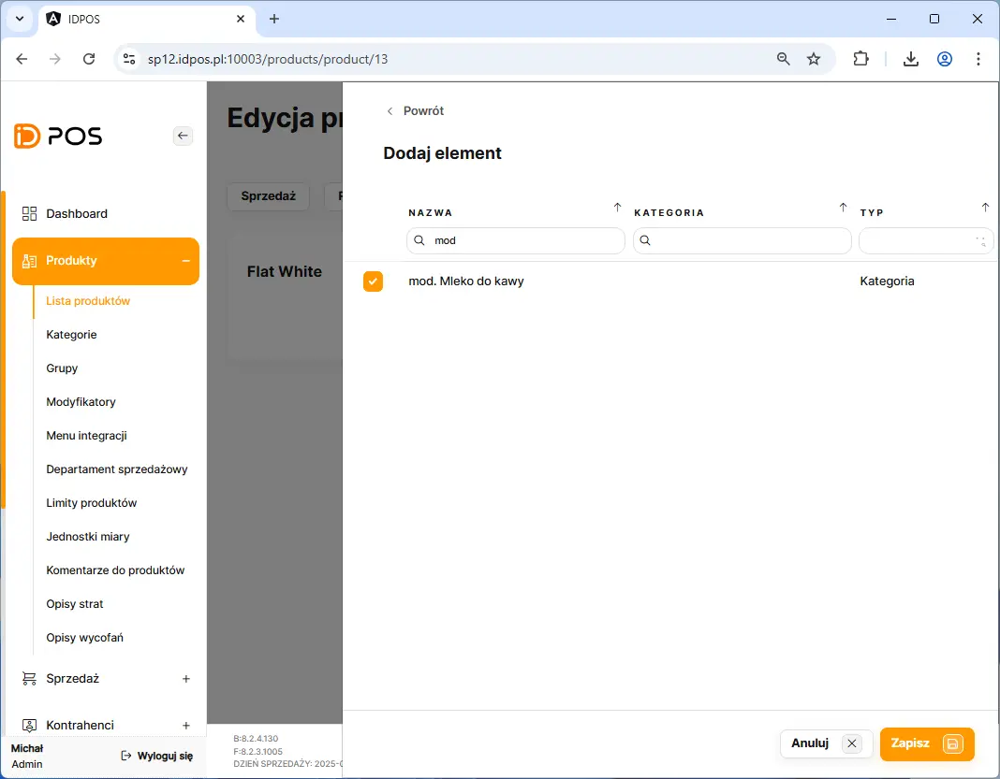
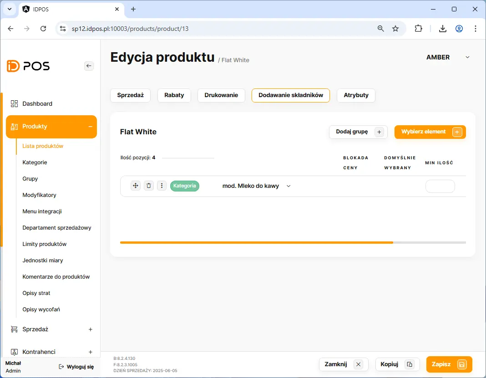
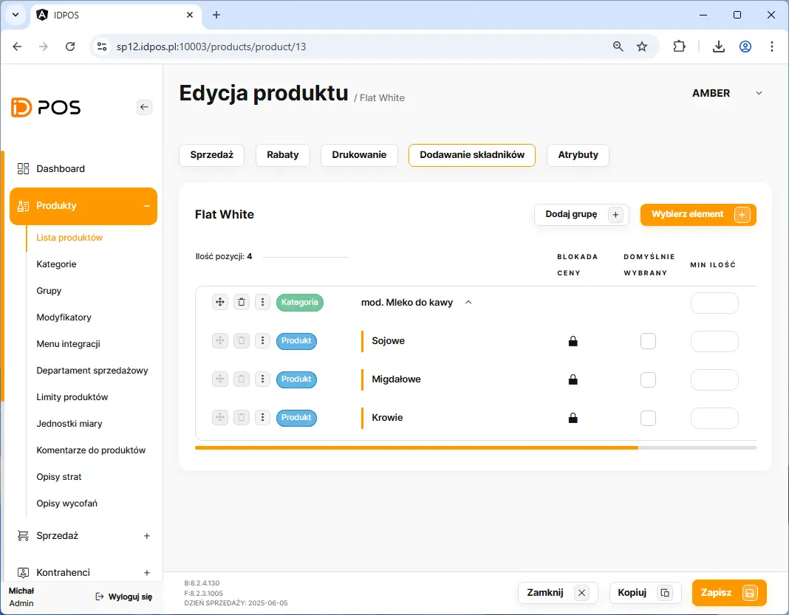
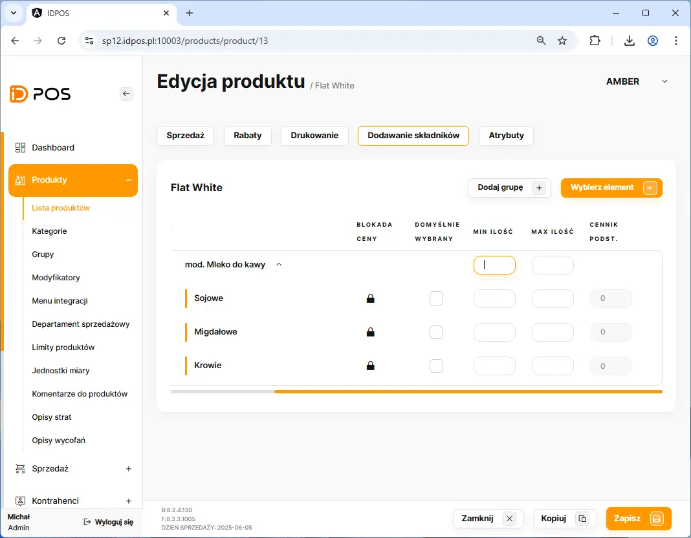

# Dodanie modyfikatora

Dodanie modyfilatora rozpoczynamy poprzez przejście w BOHu na zakładkę: **Produkty** <kbd> -> </kbd> **Kategorie**

Na liście kategorii należy kliknąć przycisk <button class="btn-id"> Dodaj kategorię    </button> 
    
<figure>

</figure>

  >  :bulb:
   >
   > Proszę wprowadzić unikalną nazwę kategorii rozpoczynająca się od prafixu **mod.**  :heavy_check_mark:
   >
   > Kategoria z prefiksem **mod.** traktowana jest jako modyfikator.
   >

<figure>

</figure>

<figure>

</figure>

##### Wymagane dane do wprawadzenia:
    - Dodanie produktów widocznych jako opcjie wyboru dla modyfikatora
    
Ważne jest aby dodając nowy produkt który będzie opcją wybory dla modyfikatora wskazać odpowiednią kategorię z prefixem mod.

<figure>

</figure>

  >  :bulb:
   >
   > W celu szybszego wprawdzanie kolejnych opcją wyboru należy skożystać z przycisku kopiuj
   >

<figure>

</figure>

<figure>

</figure>

<figure>

</figure>

Po stowżeniu kategorii z modyfikatorami należy przejść na produkt który ma mieć podłączony modyfikator

<figure>

</figure>

<figure>

</figure>

<figure>

</figure>

<figure>

</figure>

<figure>

</figure>

<figure>

</figure>

<figure>

</figure>

<figure>

</figure>

<figure>

</figure>