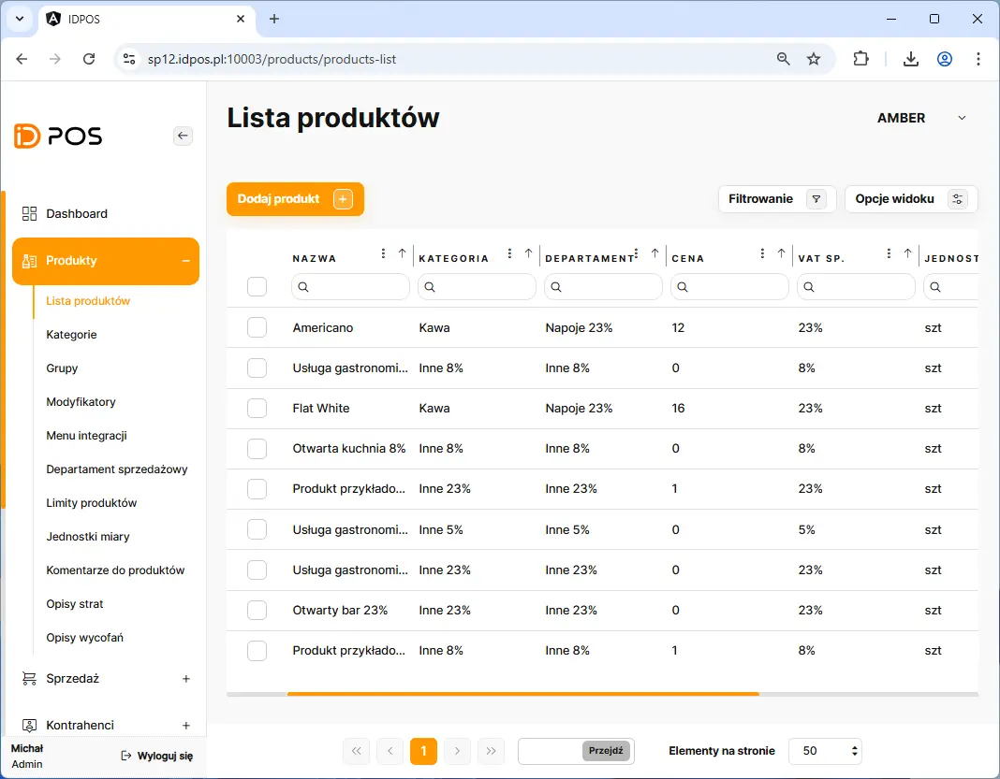
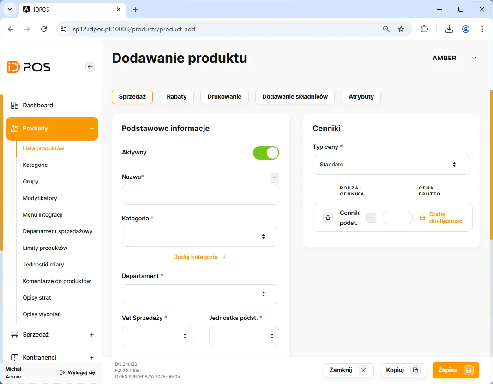
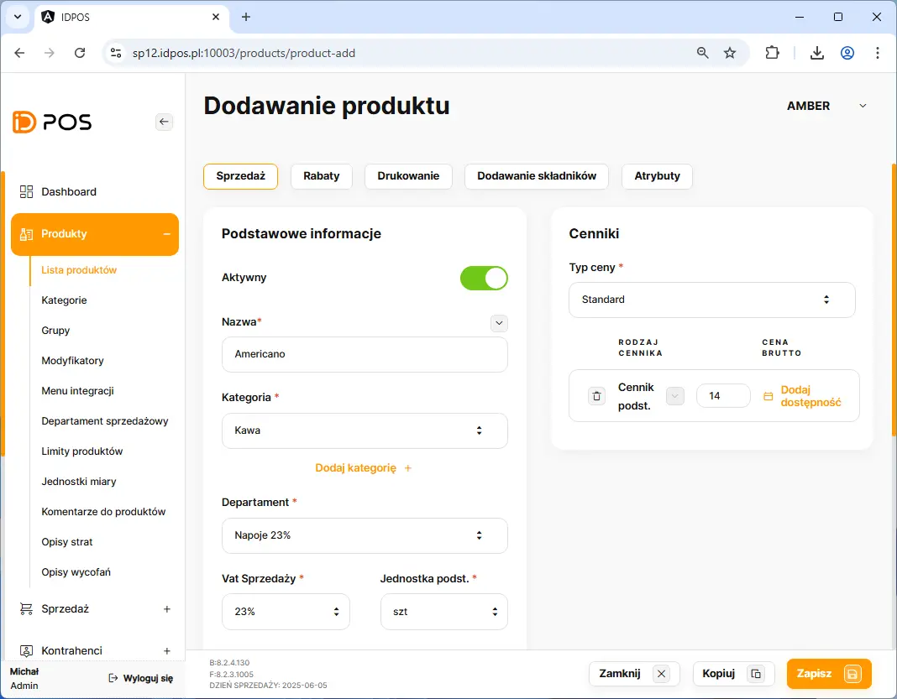
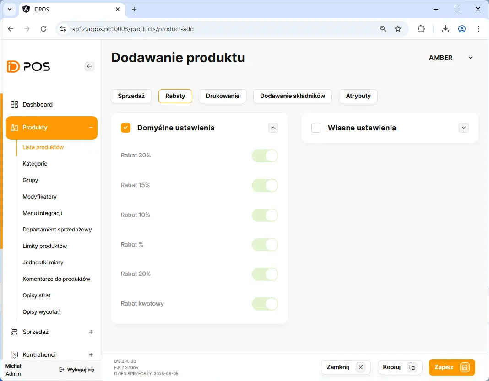
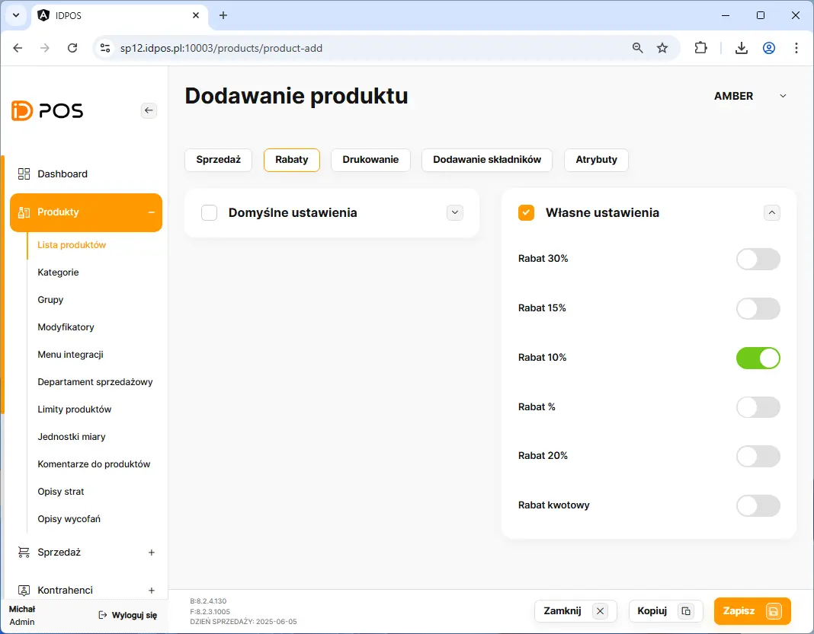
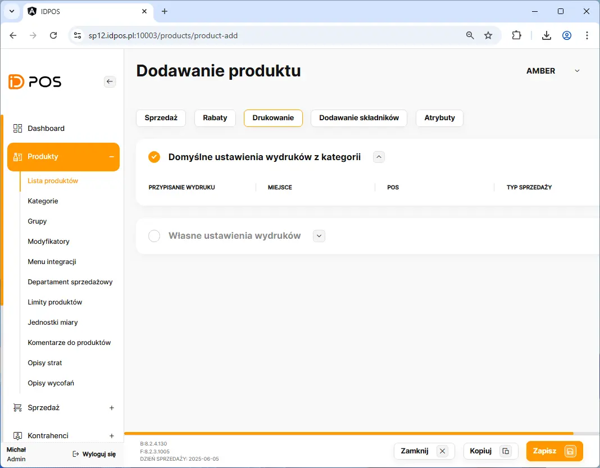
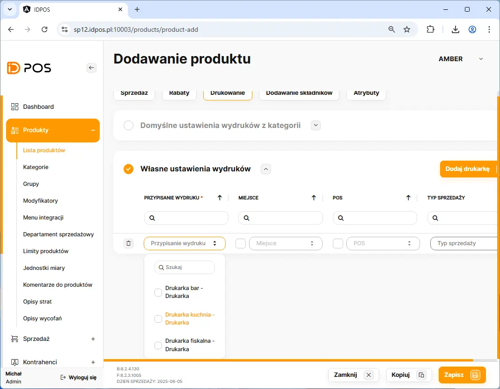

# Dodanie produktu sprzedażowego

Dodanie nowego produktu rozpoczynamy poprzez przejście w BOHu na zakładkę: **Produkty** <kbd> → </kbd> **Lista produktw**

Na liście produktów należy kliknąć przycisk <button class="btn-id"> Dodaj Produkt  +  </button> 

##### Wymagane dane do wprawadzenia:
    - Unikalna nazwa produktu
    - Kategoria sprzedażowa
    - Departament sprzedażowy
    - vat
    - jednostka miary
    - cena

##### Opcjonalne dane do wprawadzenia:
    - Dodatkowy cennik 
    - Promocja czasowa
    - kod EAN
    - krótki kod sprzedażowy
    - sprzedaż niecałkowita - możliwość sprzedaży 0.5 porcji
    - ważony - przy sprzedaży pos wywyłuje klawiaturę z możliwościa wpisania ilości produktu lub możliwość podłączenia wagi
    - produkt fakturowy - udostępnia możliwość wybory prodkutu jako pozycja na fv
    - opakowanie zwrotne - ustawienie kaucji np. eko kubek, butelka

<figure>

</figure>

<figure>

</figure>

<figure>

</figure>

<figure>

</figure>

<figure>

</figure>

<figure>

</figure>

<figure>

</figure>
