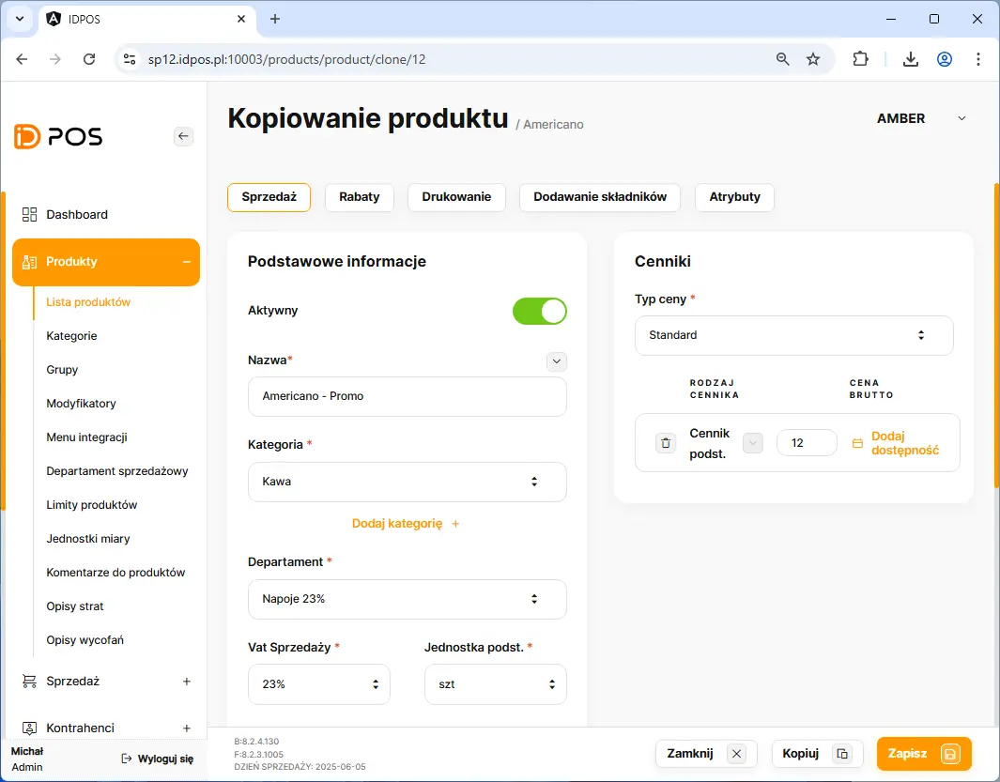
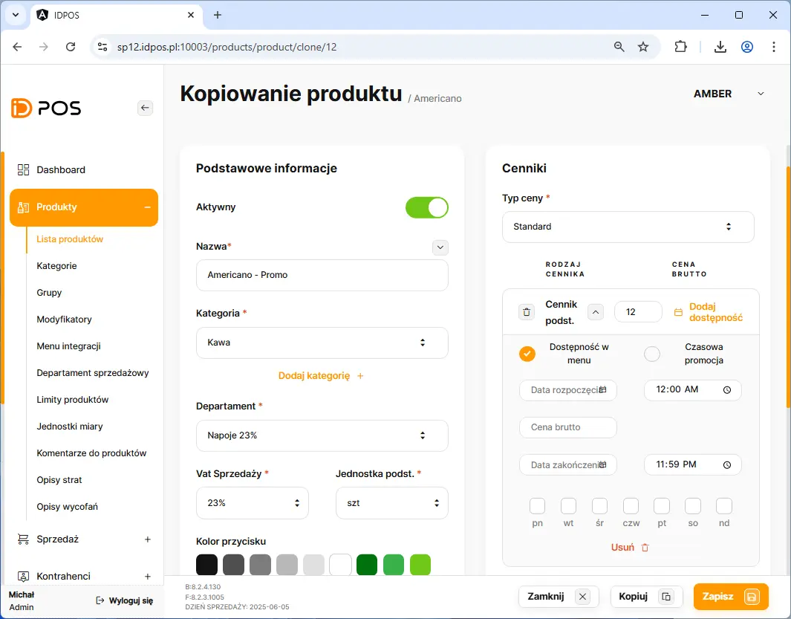
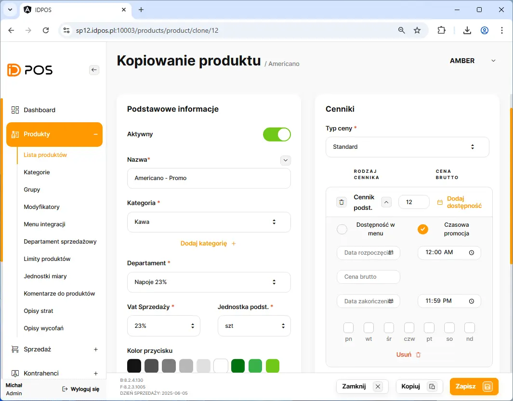
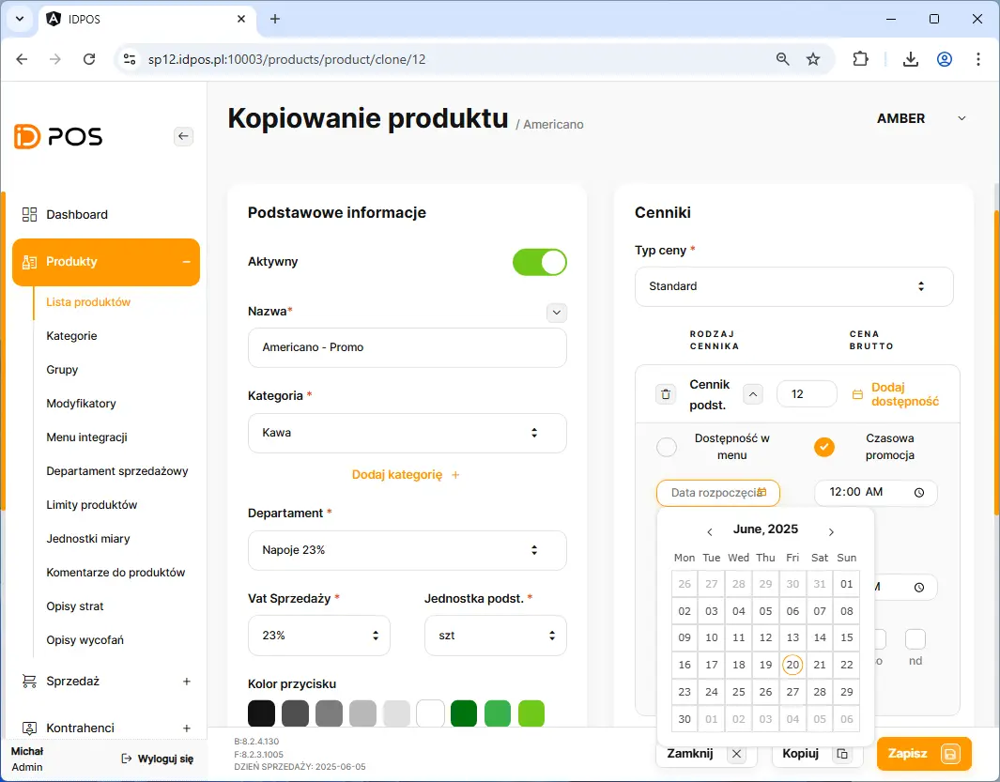
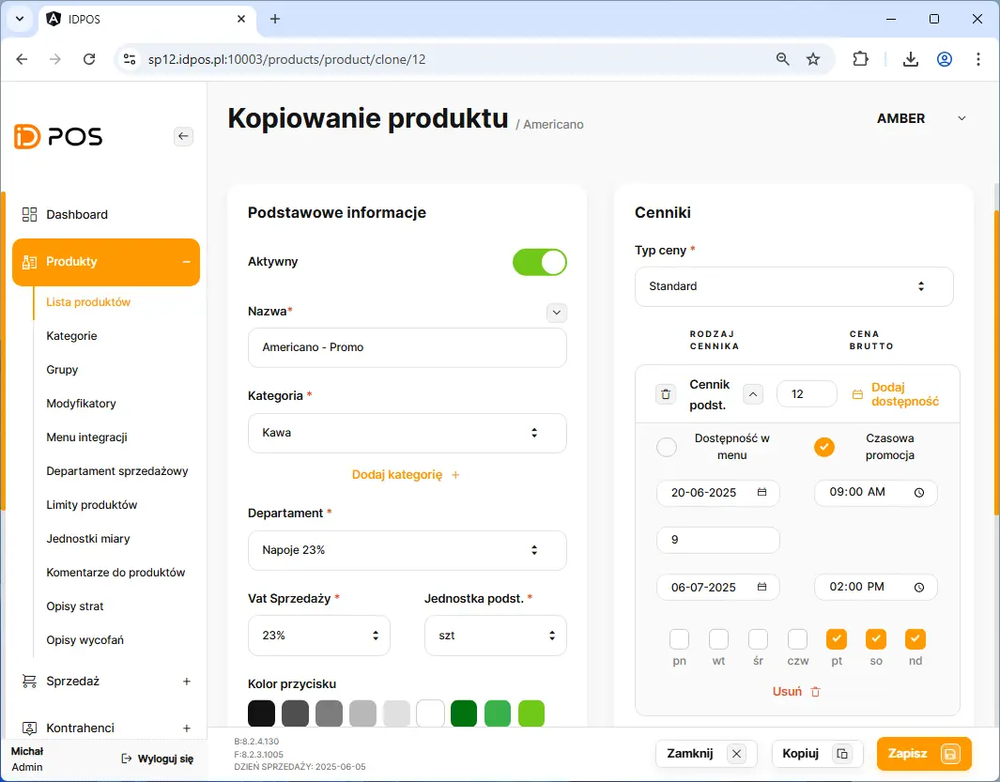

# Dodanie promocji do produktu

Dodanie nowej promocji rozpoczynamy poprzez przejście w BOHu na zakładkę: **Produkty** <kbd> → </kbd> **Lista produktw**

Na liście produktów należy wyszukać produk po nazwie lub kategorii.

##### Wymagane dane do wprawadzenia:
    - Data rozpoczęcia promcji
    - Data zakończenia promocji 
    - Wybur dni obiętych promocją 
    - Cena promocyjna

<figure>

</figure>

<figure>

</figure>

<figure>

</figure>

<figure>

</figure>

<figure>

</figure>

<button class="btn-id"> Zapisz  :floppy_disk:  </button> 

