INSTRUKCJA OBSŁUGI INTEGRACJI IDPOS z Restimo

Integracja odbywa się przez zmapowanie produktów wysłanych z idposa do resthuba. Przed uruchomieniem integracji należy sprawdzić i przygotować:

1. Skonfigurować kanały integracji, dla każdego zewnętrznego dostawcy. (Konfiguracja serwisu IDPOS)  
2. Przygotować menu sprzedażowe w liście produktów (IDPOS)  
3. Skonfigurować menu integracji z wybranymi kategoriami i pozycjami które są w resthubie następnie je wysłać. (IDPOS)  
4. Sprawdzić produkty w Resthubie pod względem zgodności stawek, wszystkie produkty powinny mieć ustawioną realną stawkę vat tj. wartości 23,8,5,0. (RESTHUB)  
5. Mapowanie produktów wysłanych z idposa na lokalizacji. (RESTHUB)

MAPOWANIE PRODUKTÓW:

1. IDPOS

   W pierwszej kolejności przygotowujemy menu sprzedażowe, następnie przechodzimy do Produkty \-\> Menu Integracji, gdzie tworzymy nowe menu. Wprowadzamy nazwę, zaznaczamy wszystkie kanały które biorą udział w integracji następnie możemy przejść do dodawania kategorii sprzedażowych przez “wybierz grupę”

<figure>
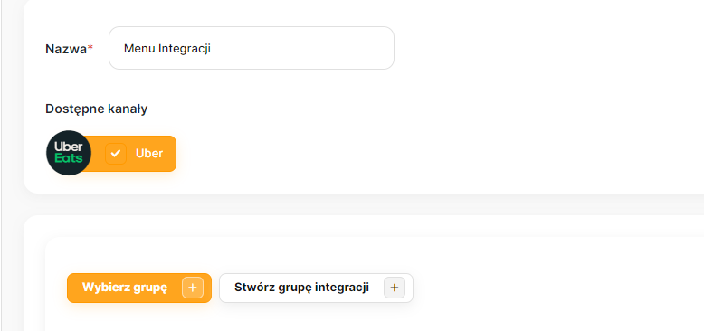
</figure>

W oknie wyszukiwania po prawej stronie zaznaczamy typ “kategoria” w ostatniej kolumnie i wybieramy potrzebne nam kategorie następnie zatwierdzamy przez “zapisz”. 
<figure>
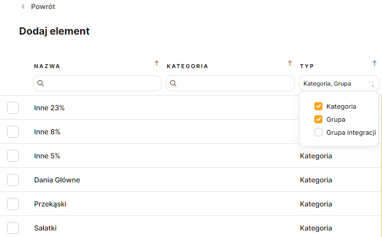
</figure>

Na głównym widoku mamy dodane kategorie, możemy sprawdzić czy są wszystkie potrzebne produkty i dodać lub usunąć. Dodajemy używając menu 3 kropek na poziomie kategorii wybierając “nowy element”

<figure>
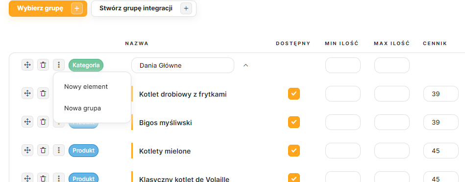
</figure>

Usuwamy pozycje przez kosz w wierszu z produktem

<figure>
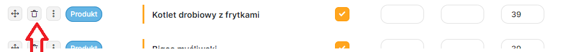
</figure>

Menu integracji nie aktualizuje się automatycznie tak jak menu sprzedażowe, każdą zmianę należy wprowadzić na głównej liście produktów i zaktualizować w istniejącym menu integracji. Ceny produktów będą przekazywane z restimo dlatego nie musimy ich aktualizować na menu integracji.

Po skończonej konfiguracji menu należy zapisać i wysłać do resthuba “zapisz i wyślij”, dalsza część mapowania odbywa się w panelu resthuba.

<figure>
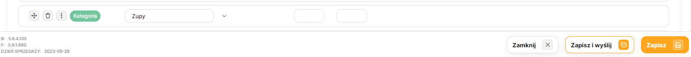
</figure>

2\. RESTHUB

 Do mapowania produktów przechodzimy: menu, lokalizacje \-\> odpowiednia lok. połączona z idposem \-\> "szczegóły" \-\> zakładka "POSY".

W dolnej części strony widzimy dwie kolumny z pozycjami, z lewej strony są produkty które zostały wysłane z idposa a z prawej pola w których wskazujemy produkt istniejący w resthubie.

<figure>
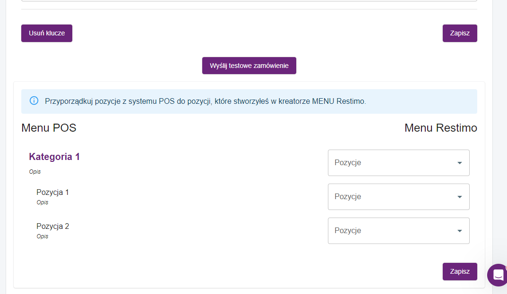
</figure>

Produkty mapujemy klikając w puste pole i wybierając produkt z listy, działa wyszukiwanie po nazwie, wystarczy zacząć wpisywać litery w polu “pozycje” żeby znaleźć produkt:  
<figure>
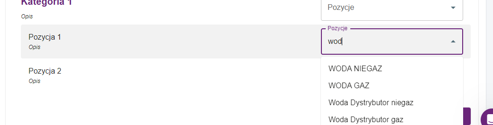
</figure>

Pobrana zostaje cała struktura naszego menu z idposa, dlatego trzeba zwrócić uwagę przy mapowaniu i powiązać tylko produkty sprzedażowe pomijając kategorie, grupy itp.

Po skończonej konfiguracji należy ją zapisać za pomocą przycisku po prawej stronie na samym dole strony, nie mylić z przyciskiem zapisz nad “Menu <figure>
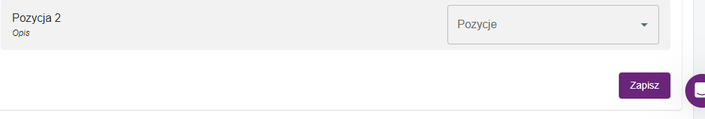
</figure>

Do uruchomienia przekazywania rachunków potrzebna jest konfiguracja

 Webhooków na zakładce public api

2\. Flagi do wysyłania zamówień na zakładce “ogólne”

<figure>
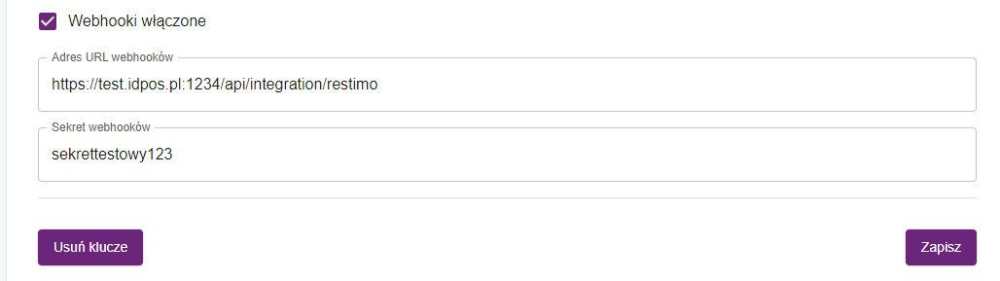
</figure>

Przy poprawnej konfiguracji powyżej, zamówienia będą automatycznie przekazywane do posa po zatwierdzeniu ich w panelu resthuba.

Wszystkie produkty w restimo powinny mieć ustawioną zgodną z matrycą stawkę VAT(23,8,5,0) tak żeby w przypadku nowych pozycji przychodzących z resthuba które nie zostały jeszcze zmapowane mogły dodać się do rachunku jako produkt mapujący stawkę VAT w idposie. Należy również zweryfikowane menu resthuba opublikować do wszystkich kanałów (uber,wolt itd.)

W przypadku produktu który nie został jeszcze zmapowany a posiada wpisaną stawkę VAT np. 9 w resthubie, zamówienie z takim produktem nie zostanie przyjęte na posie.

<figure>
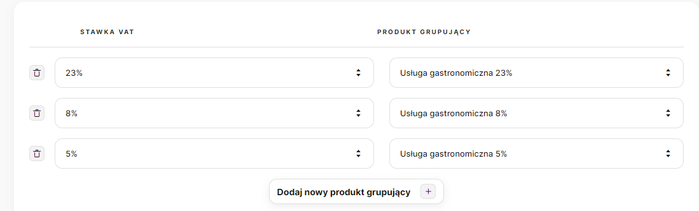
</figure>

3\. POS

Obsługa integracji na posie odbywa się na oddzielnym pulpicie rachunków, żeby do niego przejść klikamy przycisk widoczny poniżej który znajduje się na ekranie otwartych rachunków.
<figure>
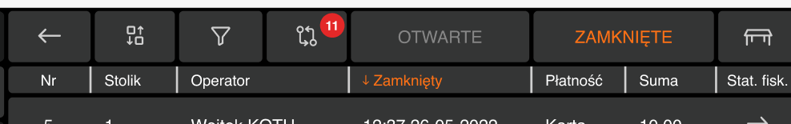
</figure>

Zamówienia które pojawiają się w resthubie są notyfikowane przez baner na posie, na   
banerze znajduje się przycisk do przejścia na ten sam ekran rachunków.

**Nowe zamówienie musi zostać zaakceptowane na panelu resthuba, a dopiero potem obsługiwane na posie, jest to bardzo istotne do poprawnego działania integracji. To samo dotyczy się zmiany statusów zamówienia \- wykonujemy je na resthubie.**

Pulpit rachunków z integracji dzieli się na 4 części
<figure>
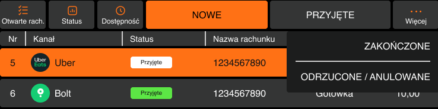
</figure>

W integracji z restimo rachunki zatwierdzone w resthubie będą przechodzić od razu do “PRZYJĘTE”, w tym czasie drukuje się też bon na drukarce zamówieniowej zgodnie z ustawionymi kierunkami wydruków. Do kolejnych sekcji rachunki trafiają po zmianie statusu w resthubie. 

Na pulpicie rachunków przyjętych zamówienie będzie widoczne do czasu zmiany statusu na zakończone lub odrzucone\\anulowane. Z tego miejsca możemy takie zamówienie zamknąć, ostatnia kolumna sygnalizuje nam które zamówienia nie zostały jeszcze zafiskalizowane. 

Rachunek który został przyjęty będzie miał domyślną formę płatności skonfigurowaną w kanałach integracji. Zamówienie możemy też edytować jeżeli mamy odpowiednie uprawnienia.

<figure>
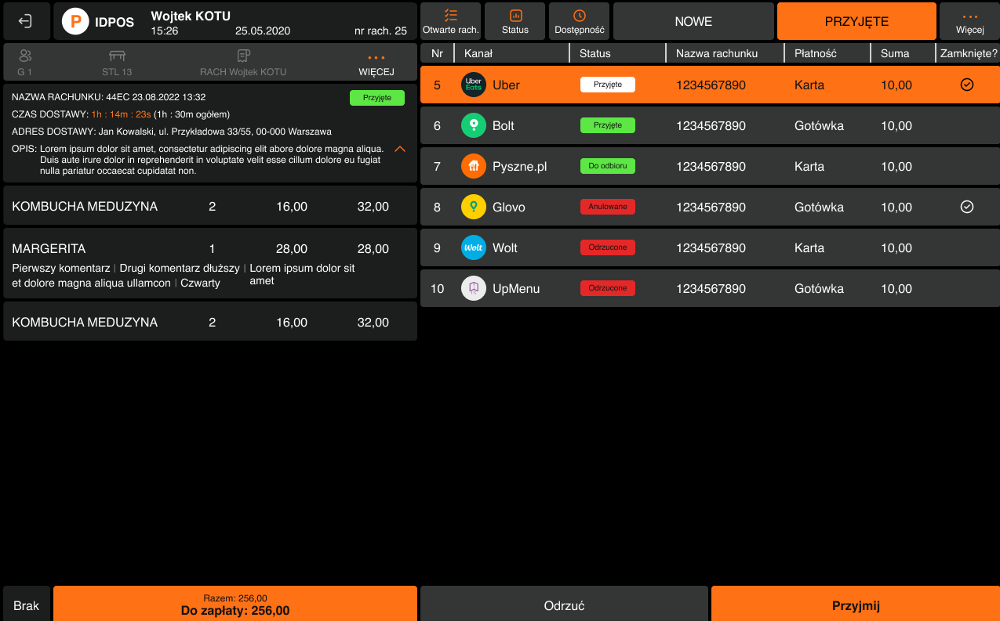
</figure>

Na koniec dnia należy sprawdzić w “zakończone” czy nie zostały jakieś rachunki otwarte, i je zamknąć. 
