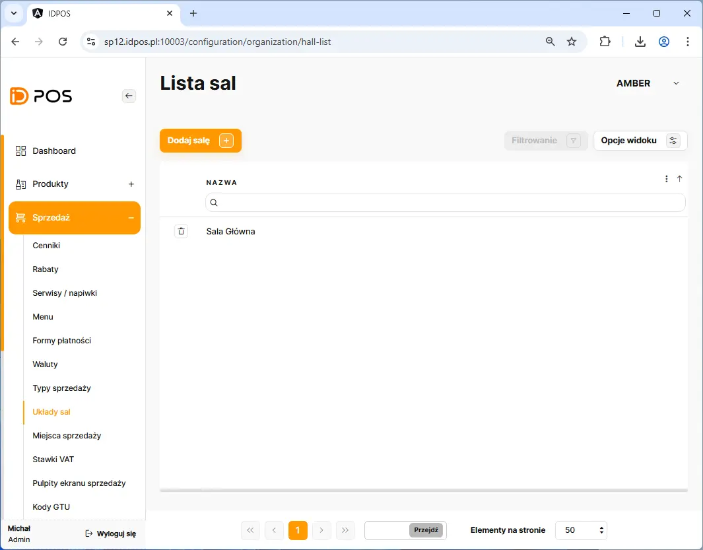
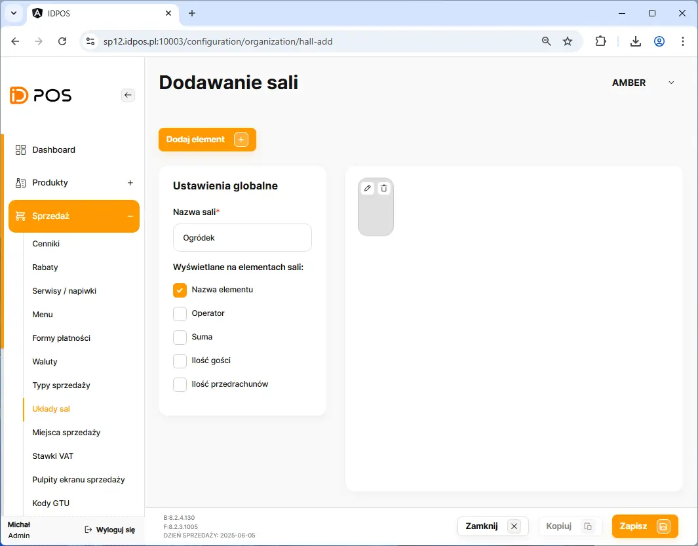
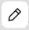
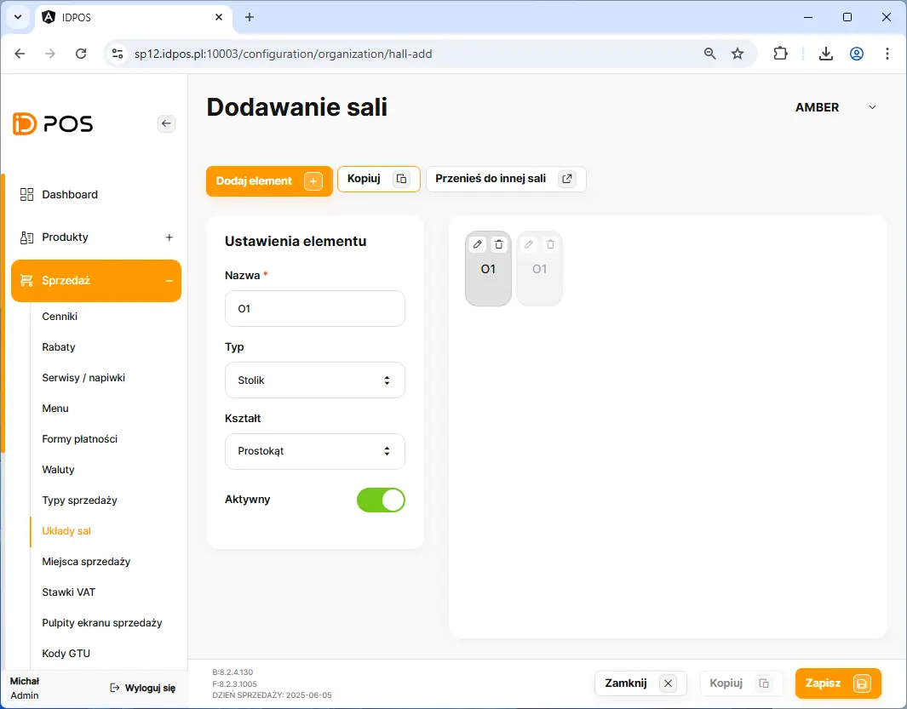
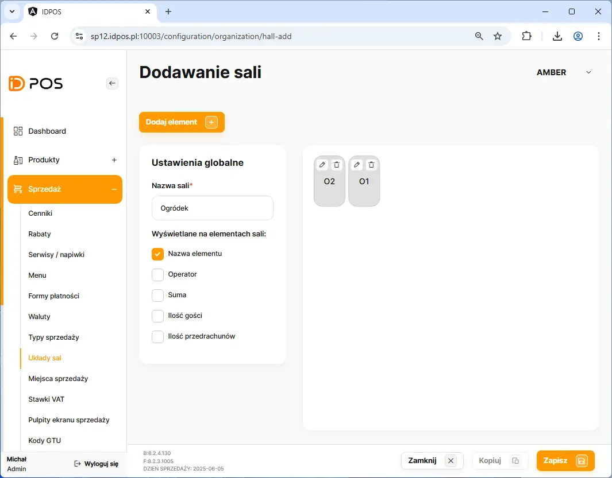
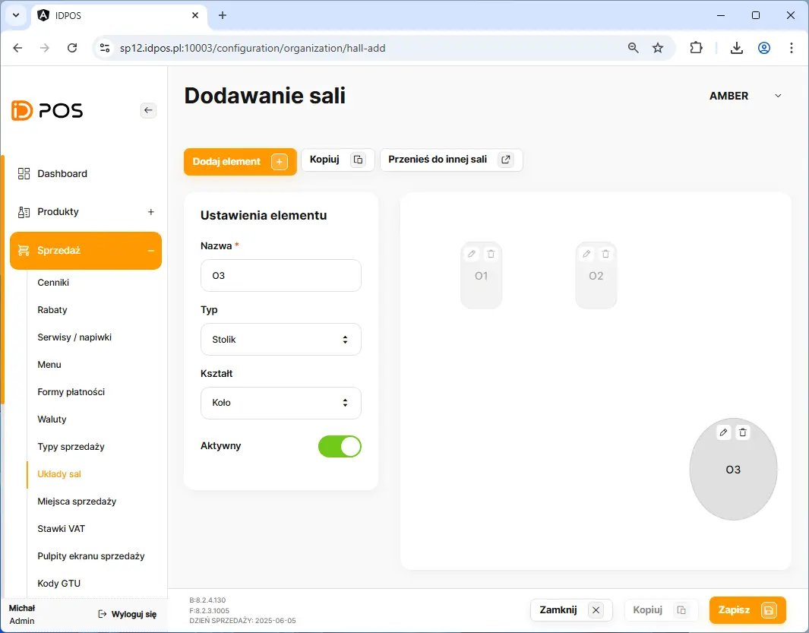
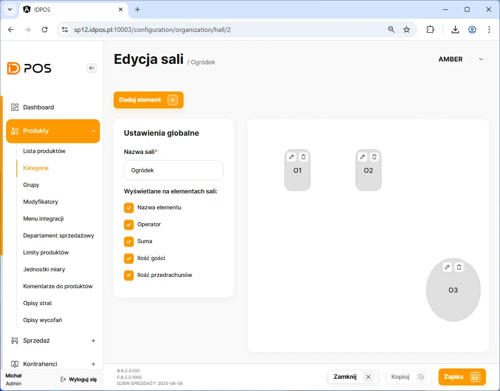
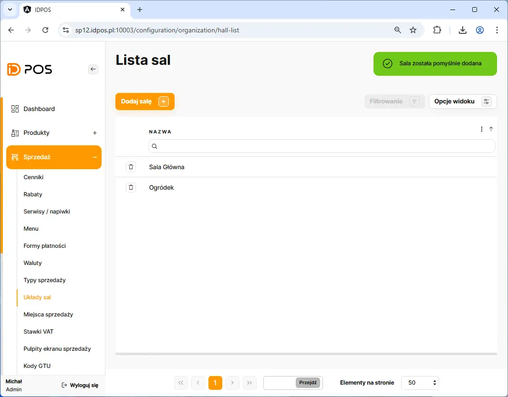

# Dodanie nowego układu sali

Dodanie nowego układu sal rozpoczynamy poprzez przejście w BOHu na zakładkę: **Sprzedaż** <kbd> → </kbd> **Układy sal**

Na liście sal należy kliknąć przycisk <button class="btn-id"> Dodaj salę  +  </button> 

<figure>

</figure>

##### Wymagane dane do wprawadzenia:
    - Unikalna nazwa sali

##### Opcjonalne dane do wprawadzenia:
    - wyświetlanie informacji na stoliku
        - Nazwa stolika
        - Operator 
        - Suma 
        - Ilość gości
        - Ilość przedrachunków
   
<figure>

</figure>

<figure>

</figure>

  > :warning:
   >
   > W celu wprowadznie nazwy stolika należy kliknąć na stoliku symbol długopisu  co otwoży edycję stolika.
   >
   > 

##### Wymagane dane do wprawadzenia:
    - Unikalna nazwa stolika

##### Opcjonalne dane do wprawadzenia:
    - Kształt
        - Prostokąt
        - Koło
    - Typ
        - Stolik 
        - Element stały

<figure>

</figure>

<figure>

</figure>

  > :warning:
   >
   > W celu zakończenia edycji stolika naley kliknąć na stoliku symbol długopisu  co zamknie edycję stolika.
   >
   > 

<figure>

</figure>

  >  :bulb:
   >
   > Dodawanie większej ilości stolików można wykonać używając przycisku kopiuj. Następnie po kopiowaniu na każdym stoliku przypisujemy nazwę stolika przy użyciu długopisu. Po przypisaniu wyszystkich mazw należy kliknąć przycisk zapisz aby zachować zmiany. Jeżeli przycisk zapisz jest nieaktywny to należy zamknąć edycję stolika przy użyciiu długopisu. 
   >
   >
   >

<figure>

</figure>

<figure>

</figure>

  >  :bulb:
   >
   > Zmana rozmiaru stolika może zotać wykonana poprzez przytrzymanie krawędzi ubrysu stolika i przeciągnięcie w pożądanym kierunku.
   >
   >Przesuwanie stolików na sali wykonujemy poprzez przytrzymanie stolika i upuszczenie go w miejscu docelowym.
   >

<figure>

</figure>

<figure>

</figure>

<figure>

</figure>
