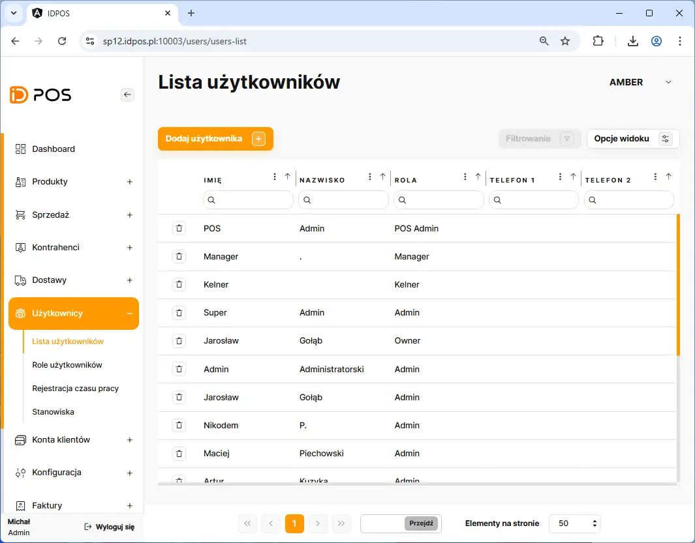
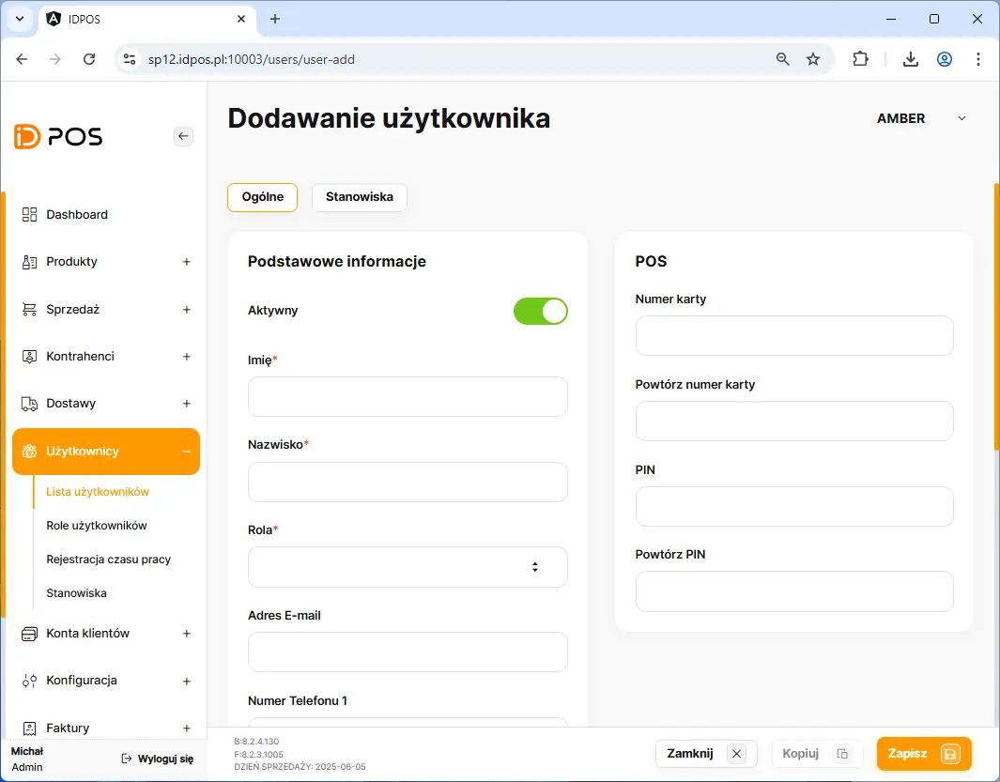
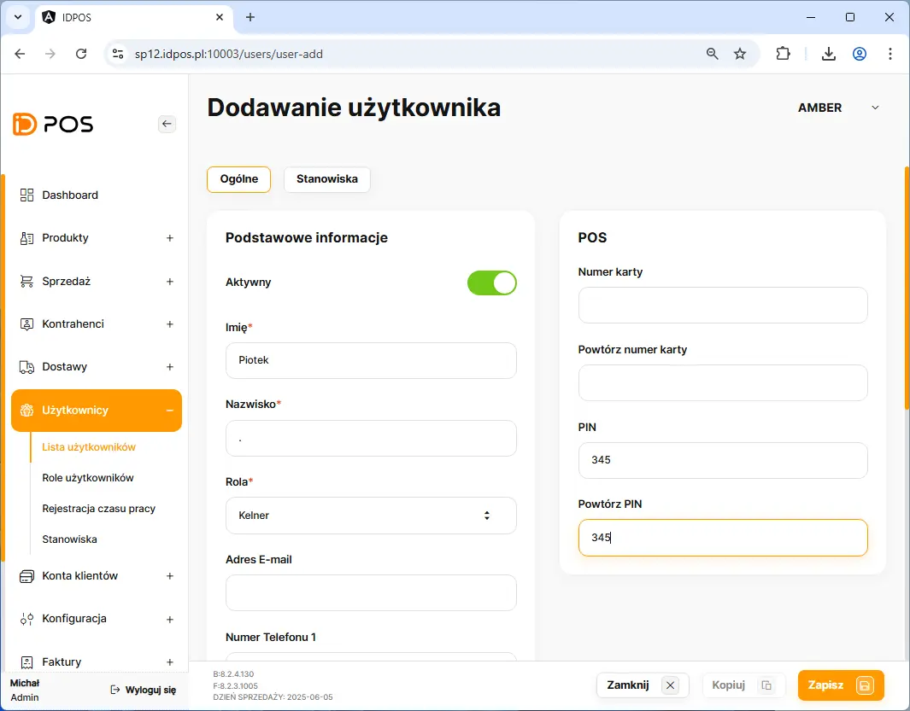
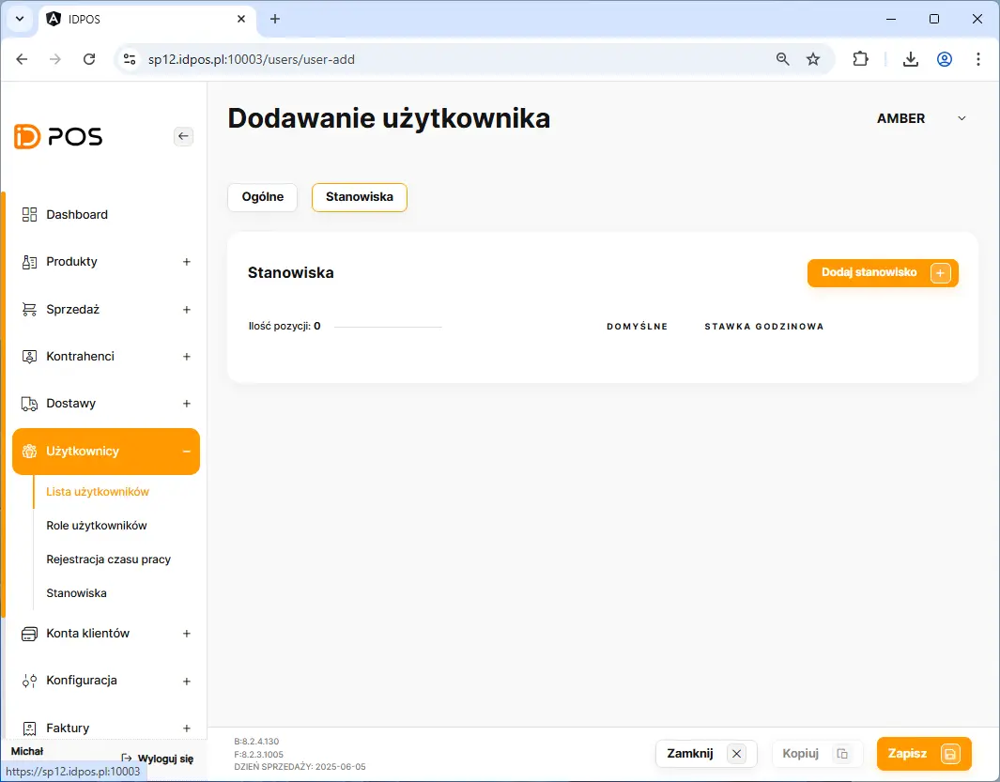
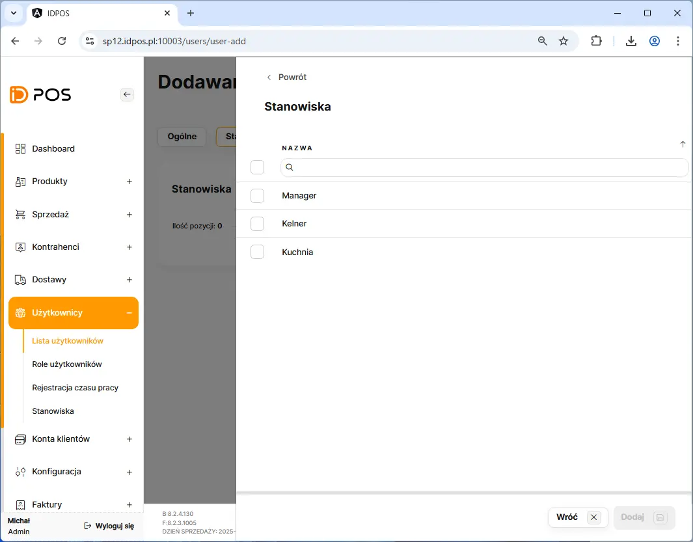
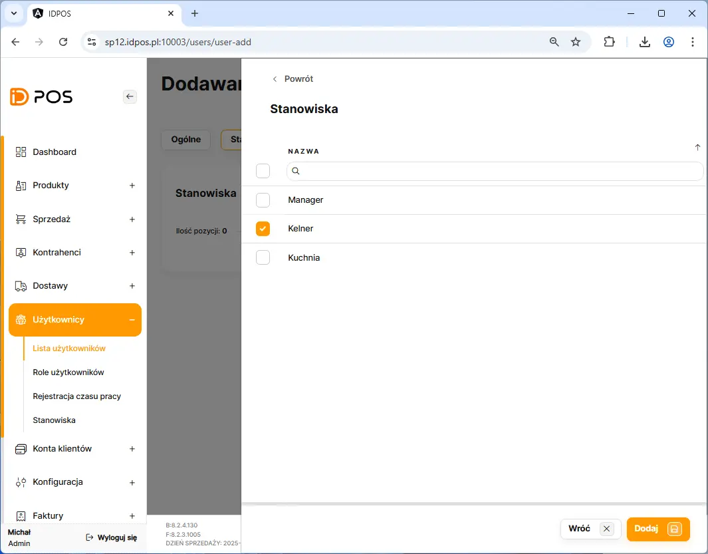
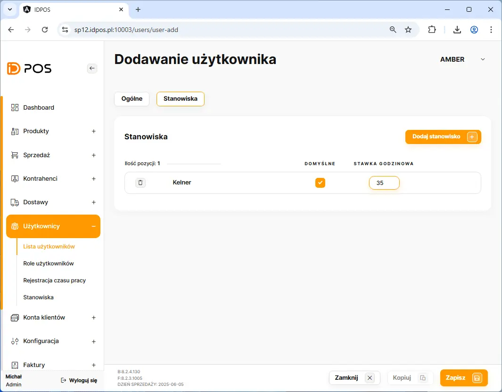
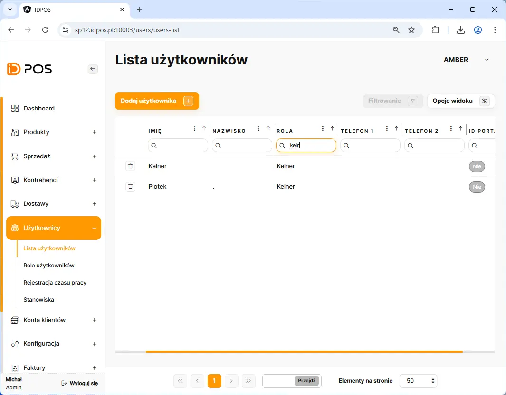

# Dodanie nowego kelnera

Dodanie nowego kelnera rozpoczynamy poprzez przejście w BOHu na zakładkę: **Użytkownicy** <kbd> → </kbd> **Lista_użytkowników**

Na liście sal należy kliknąć przycisk <button class="btn-id"> Dodaj użytkownika  +  </button> 

<figure>

</figure>

<figure>

</figure>

<figure>

</figure>

<figure>

</figure>

<figure>

</figure>

<figure>

</figure>

<figure>

</figure>

<figure>

</figure>

<figure>

</figure>
