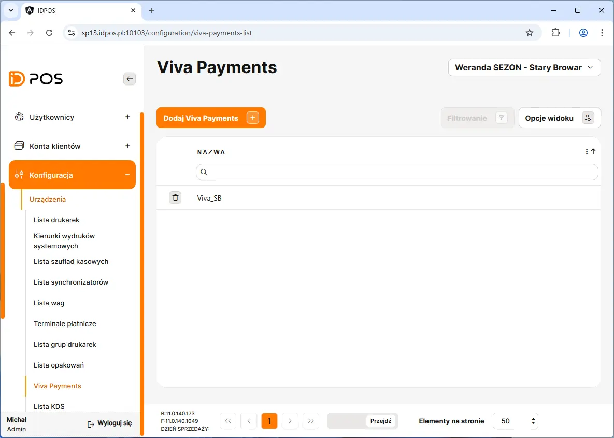
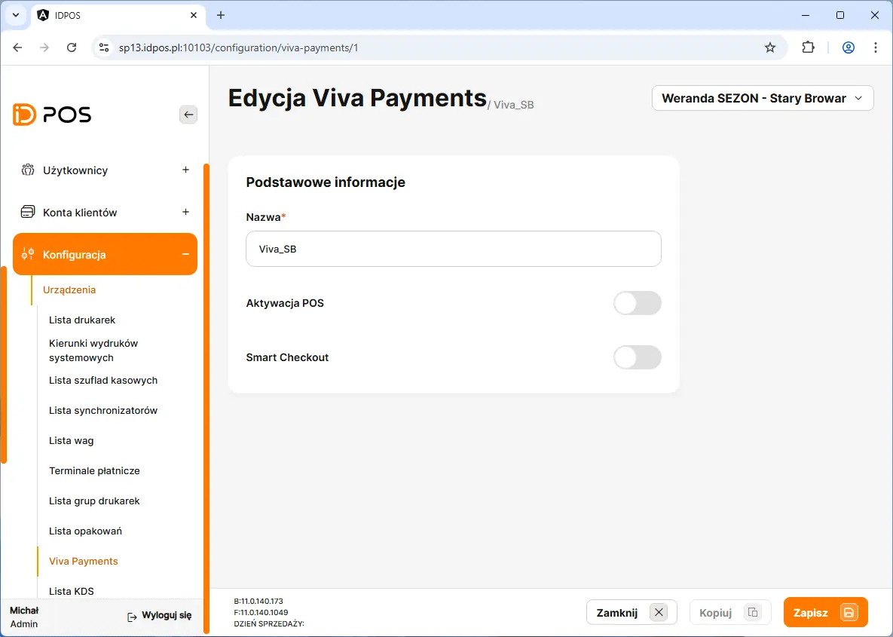
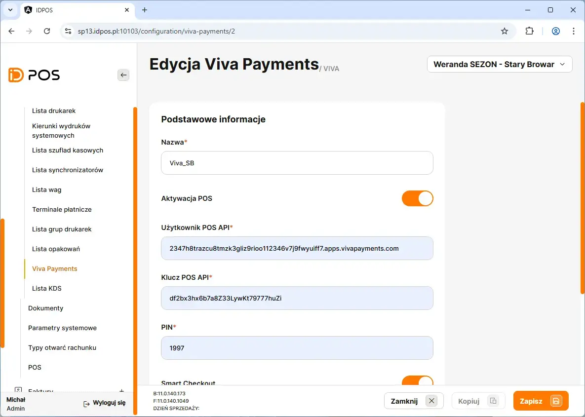
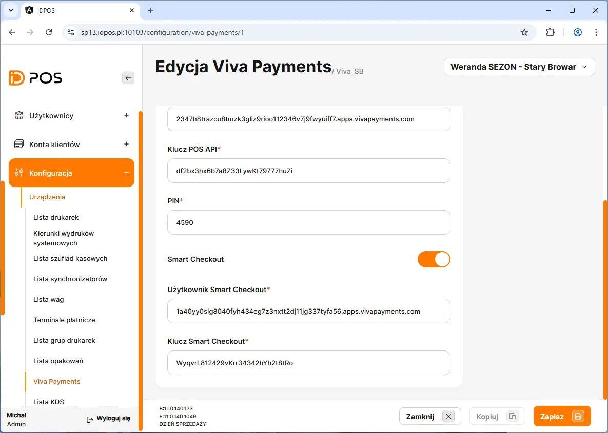
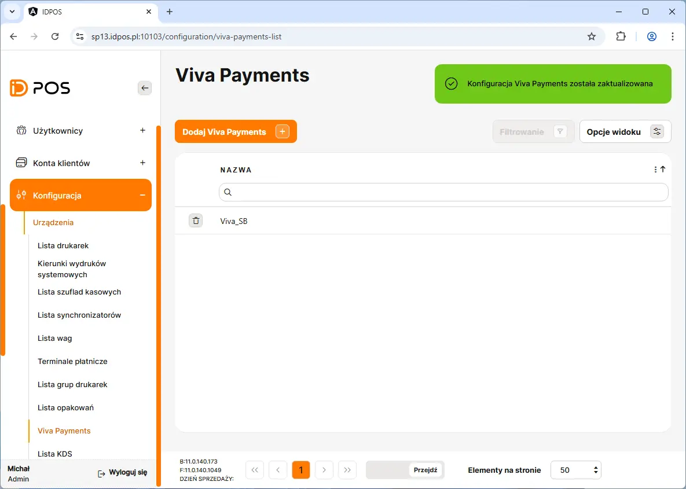
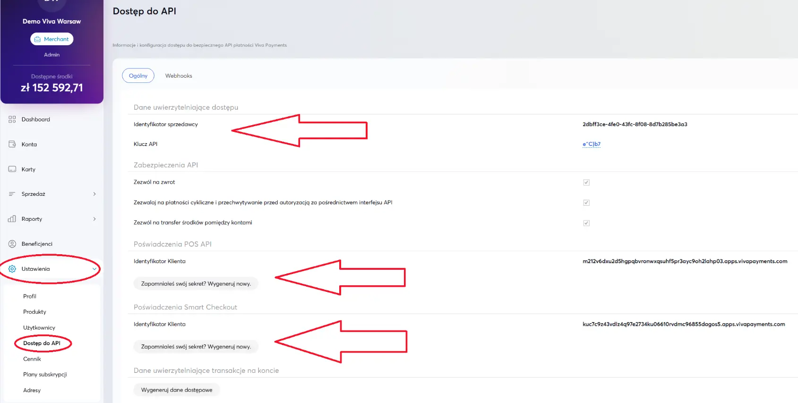

# Konfiguracja Viva Payments

Dodanie nowej konfiguracji terminala Viva rozpoczynamy poprzez przejście w BOHu na zakładkę: **Konfiguracja** <kbd> → </kbd> **Urządzenia** <kbd> → </kbd> **Viva Payments**

Na liście należy kliknąć przycisk <button class="btn-id"> Dodaj Viva Payments  +  </button> 

<figure>

</figure>

<figure>

</figure>

## Aktywacja POS

>  :bulb:
   > "Użytkownik POS API" z Boha to "Identyfilator klienta" z sekcji Poświadczenia POS API - Viva.  
   > "Klucz POS API" z Boha to "Sekret" z sekcji Poświadczenia POS API - Viva. 
   > Przy pierwszej konfiguracji należy wygenerować nowy sekret przyciskiem. 

##  Smart Checkout

>  :bulb:
   > "Użytkownik Smart Checkout" z Boha to "Identyfilator klienta" z sekcji Smart Checkout - Viva. 
   > "Klucz Smart Checkout" z Boha to "Sekret" z sekcji Smart Checkout - Viva. 
   > Przy pierwszej konfiguracji należy wygenerować nowy sekret przyciskiem.

<figure>

</figure>

<figure>

</figure>

<figure>

</figure>

<figure>

</figure>